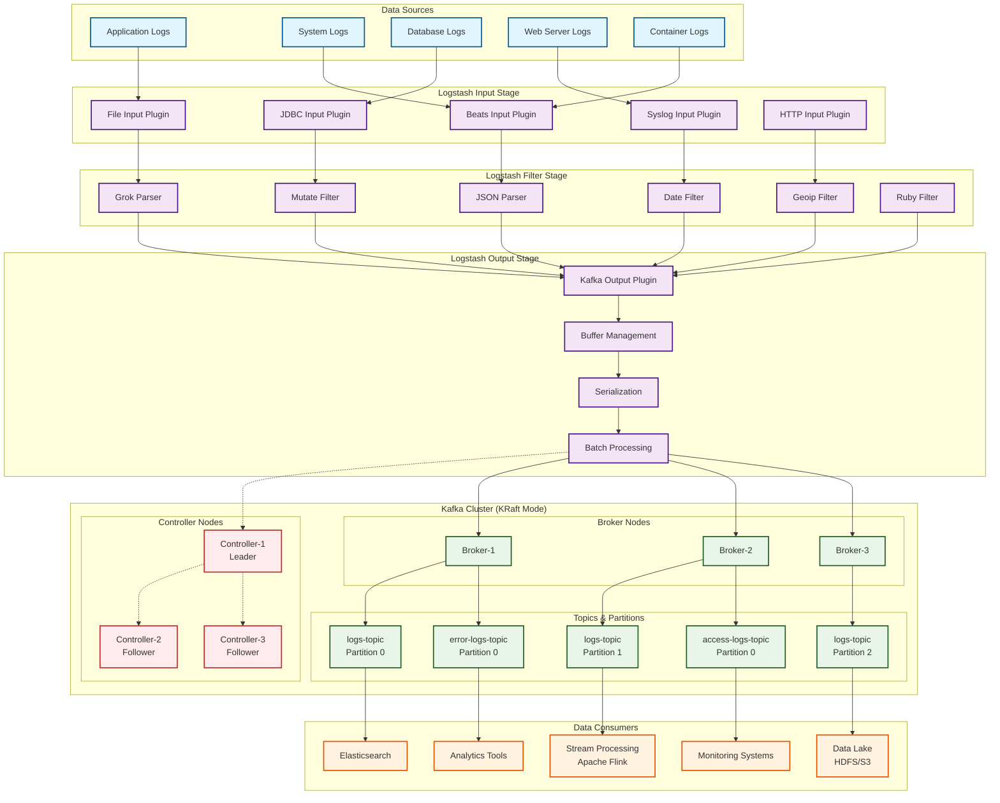

# Apache Kafka và KRaft - Tổng hợp kiến thức



## 1. Apache Kafka Overview

Apache Kafka là một hệ thống streaming platform phân tán được thiết kế để xử lý luồng dữ liệu real-time với khả năng mở rộng cao, hiệu năng cao và khả năng chịu lỗi tốt.

### Đặc điểm chính của Kafka:
- **High Throughput**: Có thể xử lý hàng triệu message/giây
- **Fault Tolerance**: Dữ liệu được replicate trên nhiều node
- **Horizontal Scalability**: Dễ dàng mở rộng bằng cách thêm broker
- **Durability**: Dữ liệu được lưu trữ bền vững trên disk
- **Real-time Processing**: Xử lý dữ liệu theo thời gian thực

## 2. Kiến trúc Kafka Core Components

### 2.1 Broker
**Broker** là server trong Kafka cluster, chịu trách nhiệm:

#### Chức năng chính:
- Lưu trữ và quản lý các partition của topics
- Xử lý request từ producers và consumers
- Đồng bộ dữ liệu với các broker khác
- Quản lý metadata về topics và partitions

#### Đặc điểm:
- Mỗi broker có một ID duy nhất trong cluster
- Có thể có nhiều broker chạy trên cùng một máy
- Broker leader chịu trách nhiệm xử lý read/write cho partition
- Broker follower đồng bộ dữ liệu từ leader

### 2.2 Topic
**Topic** là danh mục logic để tổ chức messages:

#### Đặc điểm:
- Tên topic phải unique trong cluster
- Messages trong topic được sắp xếp theo thứ tự thời gian
- Topic có thể có multiple partitions
- Dữ liệu trong topic có thể được cấu hình retention time

#### Cấu hình quan trọng:
- **Replication Factor**: Số bản copy của mỗi partition
- **Retention Policy**: Thời gian lưu trữ dữ liệu
- **Compression**: Nén dữ liệu (gzip, snappy, lz4, zstd)
- **Cleanup Policy**: Delete hoặc compact

### 2.3 Partition
**Partition** là đơn vị phân tán dữ liệu trong Kafka:

#### Đặc điểm:
- Mỗi topic được chia thành nhiều partitions
- Messages trong partition được đánh index tuần tự (offset)
- Partitions được phân tán trên các broker khác nhau
- Chỉ có thể append messages, không thể modify

#### Lợi ích:
- **Parallelism**: Multiple consumers có thể đọc song song
- **Scalability**: Thêm partition để tăng throughput
- **Load Distribution**: Phân tán tải trên nhiều broker

#### Partition Assignment:
- Round-robin: Phân tán đều messages
- Key-based: Messages cùng key vào cùng partition
- Custom partitioner: Logic phân tán tùy chỉnh

## 3. KRaft (Kafka Raft) Mode

### 3.1 Giới thiệu KRaft
KRaft là giao thức consensus mới của Kafka, thay thế ZooKeeper từ phiên bản 2.8+.

#### Lợi ích của KRaft:
- **Simplified Architecture**: Loại bỏ dependency ZooKeeper
- **Better Performance**: Giảm latency trong metadata operations
- **Easier Operations**: Đơn giản hóa việc quản lý cluster
- **Improved Scalability**: Hỗ trợ cluster lớn hơn

### 3.2 KRaft Components

#### Controller Nodes:
- Chịu trách nhiệm quản lý cluster metadata
- Sử dụng Raft consensus protocol
- Có một leader controller và multiple follower controllers

#### Broker Nodes:
- Chỉ chịu trách nhiệm xử lý data plane operations
- Nhận metadata updates từ controller nodes
- Không tham gia vào metadata consensus

### 3.3 Metadata Management trong KRaft
- **Metadata Topic**: __cluster_metadata topic lưu trữ tất cả metadata
- **Event-driven**: Mọi thay đổi metadata được ghi như events
- **Consistency**: Đảm bảo strong consistency qua Raft protocol
- **Versioning**: Metadata có versioning để đảm bảo compatibility

## 4. Producer và Consumer Patterns

### 4.1 Producer Patterns
- **Fire-and-forget**: Gửi message không chờ acknowledgment
- **Synchronous send**: Chờ acknowledgment trước khi gửi message tiếp theo
- **Asynchronous send**: Sử dụng callback để xử lý acknowledgment

### 4.2 Consumer Patterns
- **Consumer Groups**: Multiple consumers cùng group share partitions
- **Standalone Consumers**: Consumer độc lập đọc từ specific partitions
- **Exactly-once Semantics**: Đảm bảo message được xử lý đúng một lần

## 5. Replication và High Availability

### 5.1 Replication Mechanism Chi tiết

#### 5.1.1 Leader-Follower Architecture
Mỗi partition trong Kafka sử dụng mô hình leader-follower:

**Leader Replica:**
- Chịu trách nhiệm xử lý tất cả read và write requests cho partition
- Duy trì offset sequence cho partition
- Quản lý danh sách In-Sync Replicas (ISR)
- Ghi nhận metadata về partition state

**Follower Replicas:**
- Liên tục fetch data từ leader replica
- Không xử lý client requests trực tiếp
- Replicate data theo thứ tự tương tự leader
- Có thể trở thành leader khi leader fail

#### 5.1.2 In-Sync Replicas (ISR) Hoạt động
**ISR Definition:**
- Tập hợp các replicas đang "sync" với leader
- Replica được coi là "in-sync" khi:
  - Heartbeat với ZooKeeper/Controller trong thời gian cho phép
  - Fetch data từ leader trong khoảng thời gian replica.lag.time.max.ms
  - Offset lag không vượt quá replica.lag.max.messages (deprecated)

**ISR Management:**
```
Leader Replica (Partition 0):
├── Current Offset: 1000
├── ISR List: [Broker-1, Broker-2, Broker-3]
├── Follower-1 (Broker-2): Offset 999 ✓ (In-Sync)
├── Follower-2 (Broker-3): Offset 985 ✗ (Out-of-Sync)
└── Action: Remove Broker-3 from ISR
```

**ISR Shrinking và Expanding:**
- **Shrinking**: Replica bị remove khỏi ISR khi lag quá xa
- **Expanding**: Replica được add vào ISR khi catch up với leader
- **Min ISR**: Cấu hình min.insync.replicas đảm bảo số lượng ISR tối thiểu

#### 5.1.3 Acknowledgment Levels Chi tiết
**acks=0 (Fire and Forget):**
- Producer không chờ acknowledgment từ broker
- Throughput cao nhất, nhưng có thể mất data
- Use case: Metrics, logs không quan trọng

**acks=1 (Leader Acknowledgment):**
- Chờ acknowledgment từ leader replica only
- Balance giữa throughput và durability
- Risk: Data loss nếu leader fail trước khi replicate

**acks=all/-1 (All ISR Acknowledgment):**
- Chờ acknowledgment từ tất cả ISR replicas
- Durability cao nhất, throughput thấp hơn
- Kết hợp với min.insync.replicas để đảm bảo consistency

#### 5.1.4 Replication Flow Detailed
```
Producer Message Flow:
1. Producer gửi message đến Leader (Broker-1)
2. Leader write message vào local log
3. Leader update High Water Mark (HW)
4. Followers fetch request đến Leader
5. Leader response với new messages
6. Followers write vào local log
7. Followers gửi fetch request tiếp theo với new offset
8. Leader update ISR list based on follower progress
9. Leader send acknowledgment đến Producer (nếu acks=all)
```

### 5.2 Failure Handling và Recovery

#### 5.2.1 Leader Election Process
**Trigger Events:**
- Leader broker crash/network partition
- Leader broker graceful shutdown
- ISR shrink dưới min.insync.replicas

**Election Algorithm:**
```
Controller Election Process:
1. Controller detect leader failure (via heartbeat timeout)
2. Controller select new leader từ current ISR
3. Preference order: First replica in ISR list
4. Update metadata với new leader info
5. Notify all brokers về leadership change
6. Update ZooKeeper/KRaft metadata
```

**Unclean Leader Election:**
- Khi không có ISR replica available
- Allow non-ISR replica trở thành leader
- Tradeoff: Availability vs Consistency
- Config: `unclean.leader.election.enable`

#### 5.2.2 Replica Recovery Process
**Startup Recovery:**
```
Replica Recovery Steps:
1. Replica khởi động và đọc local log
2. Xác định Last Committed Offset (LCO)
3. Truncate log sau LCO để đảm bảo consistency
4. Start fetching từ Leader từ LCO
5. Catch up với Leader offset
6. Join ISR khi fully synced
```

**Network Partition Recovery:**
- Replica reconnect và so sánh offset với leader
- Truncate divergent entries
- Resume normal replication process

#### 5.2.3 Split-Brain Prevention
**Controller Epoch:**
- Mỗi controller có unique epoch number
- Epoch tăng mỗi khi có controller change
- Broker reject requests từ outdated controller

**Leader Epoch:**
- Mỗi partition leader có epoch number
- Follower sử dụng epoch để detect stale leader
- Prevent inconsistency trong network partition scenarios

### 5.3 Replication Performance Tuning

#### 5.3.1 Key Parameters
**Broker Level:**
- `num.replica.fetchers`: Số thread fetch replicas
- `replica.fetch.min.bytes`: Minimum bytes per fetch
- `replica.fetch.wait.max.ms`: Maximum wait time for fetch

**Topic Level:**
- `replication.factor`: Số lượng replicas
- `min.insync.replicas`: Minimum ISR cho write success
- `replica.lag.time.max.ms`: Maximum lag time before ISR removal

#### 5.3.2 Monitoring Replication Health
**Key Metrics:**
- `UnderReplicatedPartitions`: Partitions với ISR < replication factor
- `OfflinePartitionsCount`: Partitions không có leader
- `ReplicaLag`: Offset difference giữa leader và followers
- `ISRShrinkRate`: Tần suất ISR shrinking
- `ISRExpandRate`: Tần suất ISR expanding

**Alerting Thresholds:**
- UnderReplicatedPartitions > 0
- OfflinePartitionsCount > 0
- ReplicaLag > acceptable threshold
- High ISR shrink rate

## 6. Performance và Tuning

### 6.1 Key Performance Factors
- **Batch Size**: Tối ưu batch size cho throughput
- **Compression**: Sử dụng compression algorithms hiệu quả
- **Buffer Memory**: Cấu hình memory buffers appropriately
- **Thread Configuration**: Tune số lượng IO và network threads

### 6.2 Monitoring Metrics
- **Throughput Metrics**: Messages/second, bytes/second
- **Latency Metrics**: End-to-end latency, produce/consume latency
- **Resource Metrics**: CPU, memory, disk, network utilization
- **Error Metrics**: Failed produce/consume requests, partition lag

## 7. Security Features

### 7.1 Authentication
- **SASL/PLAIN**: Username/password authentication
- **SASL/SCRAM**: Salted Challenge Response Authentication Mechanism
- **SASL/OAUTHBEARER**: OAuth-based authentication
- **mTLS**: Mutual TLS certificate-based authentication

### 7.2 Authorization
- **ACLs (Access Control Lists)**: Fine-grained permissions
- **Resource Types**: Topic, Group, Cluster, TransactionalId
- **Operation Types**: Read, Write, Create, Delete, Alter, etc.

### 7.3 Encryption
- **SSL/TLS**: Encrypt data in transit
- **Client-Broker Communication**: Secure communication channels
- **Inter-Broker Communication**: Secure replication traffic

## 8. Use Cases và Patterns

### 8.1 Common Use Cases
- **Event Streaming**: Real-time event processing
- **Log Aggregation**: Centralized logging from multiple services
- **Data Integration**: ETL/ELT pipelines
- **Microservices Communication**: Asynchronous messaging between services
- **CQRS Pattern**: Command Query Responsibility Segregation

### 8.2 Anti-patterns
- **Small Messages**: Kafka không tối ưu cho messages nhỏ (<1KB)
- **Request-Reply**: Không phù hợp cho synchronous request-response
- **Transactional Requirements**: Limited transaction support
- **Low Latency Requirements**: Có latency overhead do batching