# Grafana Observability Stack - Complete Guide

## Mục lục
- [1. Tổng quan](#1-tổng-quan)
- [2. Grafana Loki](#2-grafana-loki)
- [3. Grafana](#3-grafana)
- [4. Grafana Tempo](#4-grafana-tempo)
- [5. Grafana Mimir](#5-grafana-mimir)
- [6. Mô hình triển khai](#6-mô-hình-triển-khai)
- [7. Integration Patterns](#7-integration-patterns)
- [8. Best Practices](#8-best-practices)

---

## 1. Tổng quan

### 1.1 Giới thiệu Stack

Stack observability của Grafana Labs bao gồm 4 công cụ chính tạo thành một hệ thống giám sát toàn diện:

- **Loki**: Log aggregation system - Thu thập và quản lý logs
- **Grafana**: Visualization và dashboarding platform - Hiển thị dữ liệu
- **Tempo**: Distributed tracing backend - Theo dõi requests qua services
- **Mimir**: Long-term storage cho Prometheus metrics - Lưu trữ metrics

### 1.2 Architecture Overview

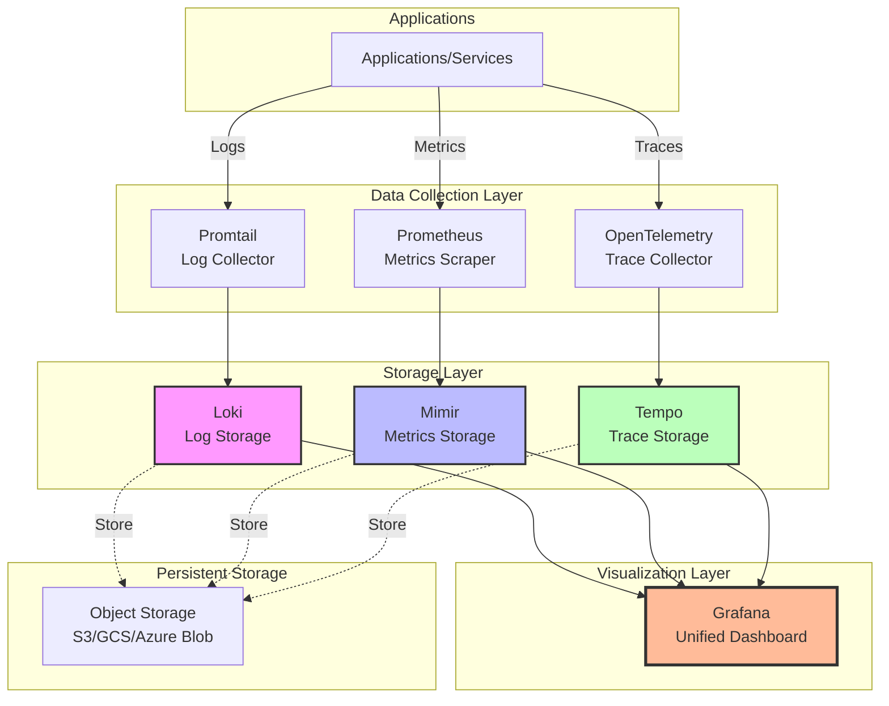
```mermaid
graph TB
    subgraph Applications
        APP[Applications/Services]
    end
    
    subgraph Collection["Data Collection Layer"]
        PROMTAIL[Promtail<br/>Log Collector]
        PROM[Prometheus<br/>Metrics Scraper]
        OTEL[OpenTelemetry<br/>Trace Collector]
    end
    
    subgraph Storage["Storage Layer"]
        LOKI[Loki<br/>Log Storage]
        MIMIR[Mimir<br/>Metrics Storage]
        TEMPO[Tempo<br/>Trace Storage]
    end
    
    subgraph Visualization["Visualization Layer"]
        GRAFANA[Grafana<br/>Unified Dashboard]
    end
    
    subgraph ObjectStorage["Persistent Storage"]
        S3[Object Storage<br/>S3/GCS/Azure Blob]
    end
    
    APP -->|Logs| PROMTAIL
    APP -->|Metrics| PROM
    APP -->|Traces| OTEL
    
    PROMTAIL --> LOKI
    PROM --> MIMIR
    OTEL --> TEMPO
    
    LOKI --> GRAFANA
    MIMIR --> GRAFANA
    TEMPO --> GRAFANA
    
    LOKI -.->|Store| S3
    MIMIR -.->|Store| S3
    TEMPO -.->|Store| S3
    
    style LOKI fill:#f9f,stroke:#333,stroke-width:2px
    style MIMIR fill:#bbf,stroke:#333,stroke-width:2px
    style TEMPO fill:#bfb,stroke:#333,stroke-width:2px
    style GRAFANA fill:#fb9,stroke:#333,stroke-width:3px
```

### 1.3 Three Pillars of Observability

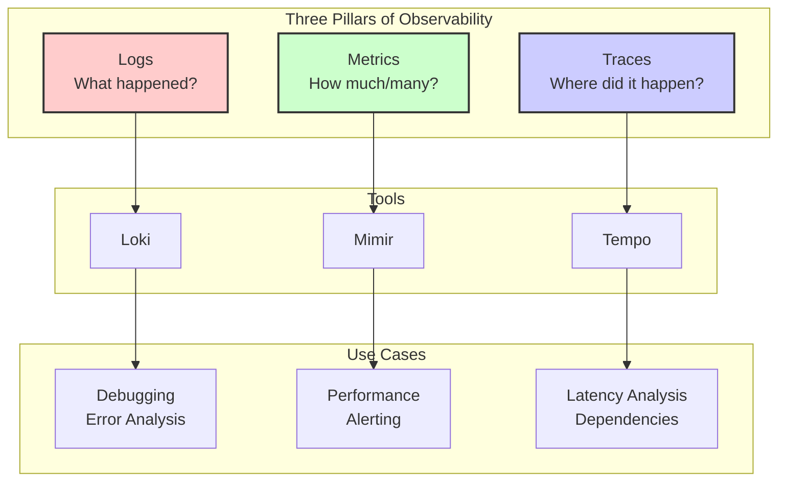
```mermaid
graph TB
    subgraph Observability["Three Pillars of Observability"]
        LOGS[Logs<br/>What happened?]
        METRICS[Metrics<br/>How much/many?]
        TRACES[Traces<br/>Where did it happen?]
    end
    
    subgraph Tools
        LOGS --> LOKI[Loki]
        METRICS --> MIMIR[Mimir]
        TRACES --> TEMPO[Tempo]
    end
    
    subgraph UseCases["Use Cases"]
        LOKI --> UC1[Debugging<br/>Error Analysis]
        MIMIR --> UC2[Performance<br/>Alerting]
        TEMPO --> UC3[Latency Analysis<br/>Dependencies]
    end
    
    style LOGS fill:#fcc,stroke:#333,stroke-width:2px
    style METRICS fill:#cfc,stroke:#333,stroke-width:2px
    style TRACES fill:#ccf,stroke:#333,stroke-width:2px
```

---

## 2. Grafana Loki

### 2.1 Giới thiệu

**Grafana Loki** là hệ thống tập trung và quản lý logs, được thiết kế để:
- Tiết kiệm chi phí lưu trữ
- Dễ vận hành và scale
- Tích hợp chặt chẽ với Grafana và Prometheus

**Khác biệt chính**: Loki chỉ index metadata (labels), không index nội dung log → giảm đáng kể chi phí storage.

### 2.2 Loki Architecture - Microservices Mode

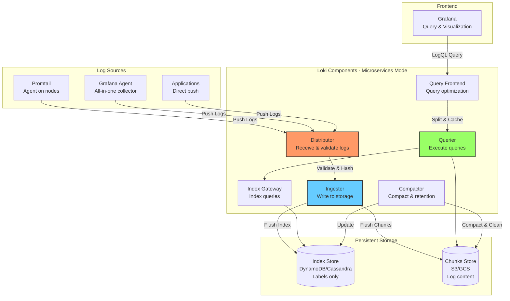
```mermaid
graph TB
    subgraph Clients["Log Sources"]
        PROMTAIL[Promtail<br/>Agent on nodes]
        AGENT[Grafana Agent<br/>All-in-one collector]
        APP[Applications<br/>Direct push]
    end
    
    subgraph LokiComponents["Loki Components - Microservices Mode"]
        DIST[Distributor<br/>Receive & validate logs]
        ING[Ingester<br/>Write to storage]
        QUERY[Querier<br/>Execute queries]
        QF[Query Frontend<br/>Query optimization]
        COMP[Compactor<br/>Compact & retention]
        IG[Index Gateway<br/>Index queries]
    end
    
    subgraph Storage["Persistent Storage"]
        INDEX[(Index Store<br/>DynamoDB/Cassandra<br/>Labels only)]
        CHUNKS[(Chunks Store<br/>S3/GCS<br/>Log content)]
    end
    
    subgraph Frontend
        GRAFANA[Grafana<br/>Query & Visualization]
    end
    
    PROMTAIL -->|Push Logs| DIST
    AGENT -->|Push Logs| DIST
    APP -->|Push Logs| DIST
    
    DIST -->|Validate & Hash| ING
    ING -->|Flush Chunks| CHUNKS
    ING -->|Flush Index| INDEX
    
    GRAFANA -->|LogQL Query| QF
    QF -->|Split & Cache| QUERY
    QUERY --> IG
    IG --> INDEX
    QUERY --> CHUNKS
    
    COMP -->|Compact & Clean| CHUNKS
    COMP -->|Update| INDEX
    
    style DIST fill:#f96,stroke:#333,stroke-width:2px
    style ING fill:#6cf,stroke:#333,stroke-width:2px
    style QUERY fill:#9f6,stroke:#333,stroke-width:2px
```

### 2.3 Loki Components Chi tiết

**Write Path (Ghi dữ liệu):**
- **Distributor**: 
  - Nhận logs từ clients
  - Validate logs format
  - Hash theo tenant ID và labels
  - Forward đến ingesters
  - Rate limiting

- **Ingester**:
  - Buffer logs trong memory (chunks)
  - Compress và flush định kỳ
  - Ghi vào object storage
  - Tạo index entries

**Read Path (Đọc dữ liệu):**
- **Query Frontend**:
  - Split queries thành nhiều phần nhỏ
  - Cache kết quả
  - Retry logic

- **Querier**:
  - Query ingesters (recent data)
  - Query storage (historical data)
  - Merge và return results

- **Index Gateway**:
  - Cache index lookups
  - Giảm load lên index store

**Background Jobs:**
- **Compactor**:
  - Compact chunks để optimize storage
  - Apply retention policies
  - Delete expired data

### 2.4 Loki Data Flow

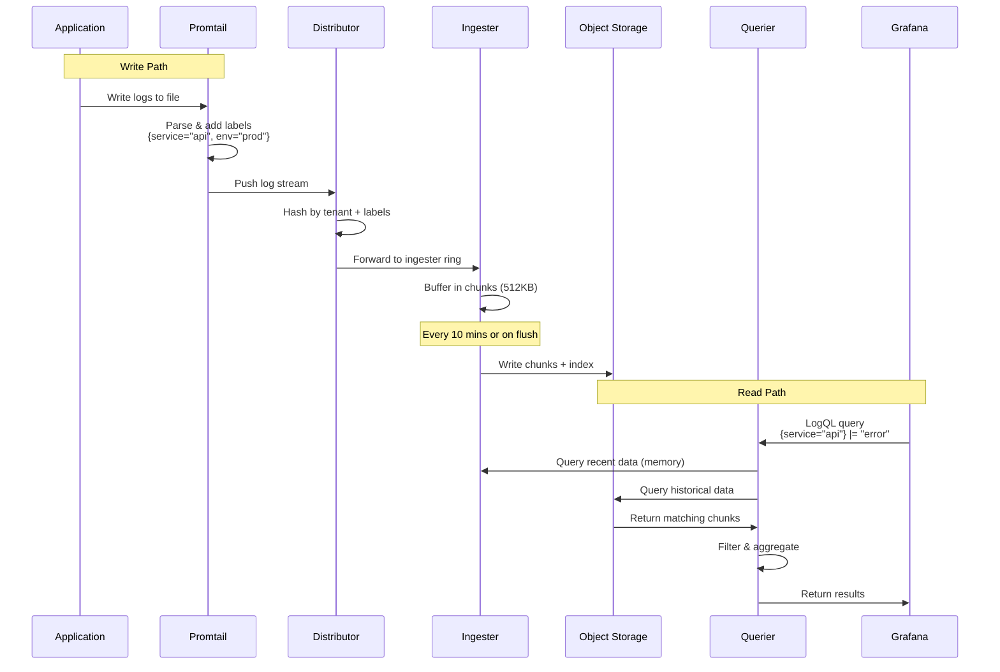
```mermaid
sequenceDiagram
    participant App as Application
    participant PT as Promtail
    participant Dist as Distributor
    participant Ing as Ingester
    participant Store as Object Storage
    participant Query as Querier
    participant Graf as Grafana
    
    Note over App,PT: Write Path
    App->>PT: Write logs to file
    PT->>PT: Parse & add labels<br/>{service="api", env="prod"}
    PT->>Dist: Push log stream
    Dist->>Dist: Hash by tenant + labels
    Dist->>Ing: Forward to ingester ring
    Ing->>Ing: Buffer in chunks (512KB)
    Note over Ing: Every 10 mins or on flush
    Ing->>Store: Write chunks + index
    
    Note over Graf,Store: Read Path
    Graf->>Query: LogQL query<br/>{service="api"} |= "error"
    Query->>Ing: Query recent data (memory)
    Query->>Store: Query historical data
    Store->>Query: Return matching chunks
    Query->>Query: Filter & aggregate
    Query->>Graf: Return results
```

### 2.5 LogQL Query Language

**LogQL** là ngôn ngữ query của Loki, tương tự PromQL:

```logql
# Stream selector - lọc theo labels
{job="varlogs", filename="/var/log/nginx/access.log"}

# Line filter - lọc theo nội dung
{job="varlogs"} |= "error" != "timeout"

# Parser - parse log lines
{job="varlogs"} | json | line_format "{{.message}}"

# Metric queries - tạo metrics từ logs
rate({job="varlogs"}[5m])
sum by (level) (rate({job="varlogs"}[5m]))
```

### 2.6 Loki Label Strategy

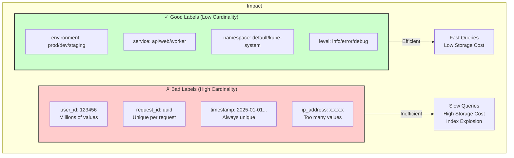
```mermaid
graph TB
    subgraph GoodLabels["✓ Good Labels (Low Cardinality)"]
        L1[environment: prod/dev/staging]
        L2[service: api/web/worker]
        L3[namespace: default/kube-system]
        L4[level: info/error/debug]
    end
    
    subgraph BadLabels["✗ Bad Labels (High Cardinality)"]
        B1[user_id: 123456<br/>Millions of values]
        B2[request_id: uuid<br/>Unique per request]
        B3[timestamp: 2025-01-01...<br/>Always unique]
        B4[ip_address: x.x.x.x<br/>Too many values]
    end
    
    subgraph Impact
        GoodLabels -->|Efficient| FAST[Fast Queries<br/>Low Storage Cost]
        BadLabels -->|Inefficient| SLOW[Slow Queries<br/>High Storage Cost<br/>Index Explosion]
    end
    
    style GoodLabels fill:#cfc,stroke:#333,stroke-width:2px
    style BadLabels fill:#fcc,stroke:#333,stroke-width:2px
```

**Best Practices:**
- Sử dụng 4-6 labels tối đa
- Labels nên có ít giá trị (< 100 values)
- Đặt dynamic data vào log content, không vào labels
- Sử dụng LogQL filters thay vì labels cho search

---

## 3. Grafana

### 3.1 Giới thiệu

**Grafana** là nền tảng open-source cho:
- Visualization và analytics
- Alerting và notifications
- Dashboard management
- Multi-datasource queries

### 3.2 Grafana Architecture

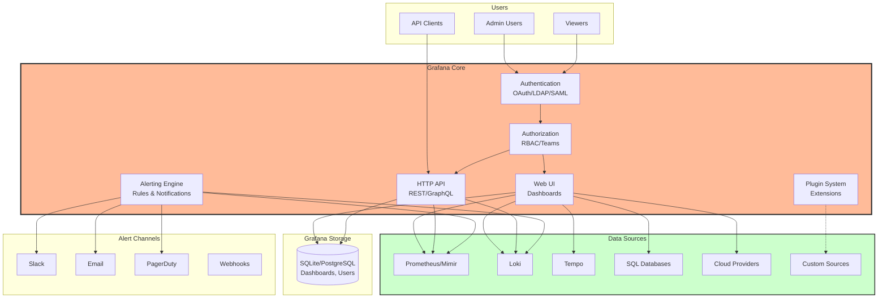
```mermaid
graph TB
    subgraph Users
        USER1[Admin Users]
        USER2[Viewers]
        USER3[API Clients]
    end
    
    subgraph GrafanaCore["Grafana Core"]
        AUTH[Authentication<br/>OAuth/LDAP/SAML]
        RBAC[Authorization<br/>RBAC/Teams]
        UI[Web UI<br/>Dashboards]
        API[HTTP API<br/>REST/GraphQL]
        ALERT[Alerting Engine<br/>Rules & Notifications]
        PLUGIN[Plugin System<br/>Extensions]
    end
    
    subgraph DataSources["Data Sources"]
        PROM[Prometheus/Mimir]
        LOKI[Loki]
        TEMPO[Tempo]
        SQL[SQL Databases]
        CLOUD[Cloud Providers]
        CUSTOM[Custom Sources]
    end
    
    subgraph Storage["Grafana Storage"]
        DB[(SQLite/PostgreSQL<br/>Dashboards, Users)]
    end
    
    subgraph Notifications["Alert Channels"]
        SLACK[Slack]
        EMAIL[Email]
        PAGER[PagerDuty]
        WEBHOOK[Webhooks]
    end
    
    USER1 --> AUTH
    USER2 --> AUTH
    USER3 --> API
    
    AUTH --> RBAC
    RBAC --> UI
    RBAC --> API
    
    UI --> PROM
    UI --> LOKI
    UI --> TEMPO
    UI --> SQL
    UI --> CLOUD
    
    API --> PROM
    API --> LOKI
    
    UI --> DB
    API --> DB
    
    ALERT --> PROM
    ALERT --> LOKI
    ALERT --> SLACK
    ALERT --> EMAIL
    ALERT --> PAGER
    
    PLUGIN -.-> CUSTOM
    
    style GrafanaCore fill:#fb9,stroke:#333,stroke-width:3px
    style DataSources fill:#cfc,stroke:#333,stroke-width:2px
```

### 3.3 Dashboard Types & Use Cases

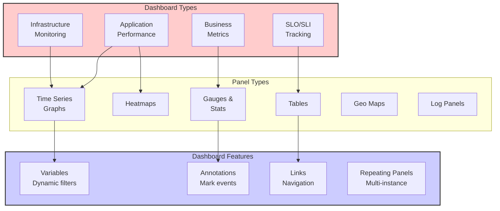
```mermaid
graph TB
    subgraph DashboardTypes["Dashboard Types"]
        INFRA[Infrastructure<br/>Monitoring]
        APP[Application<br/>Performance]
        BIZ[Business<br/>Metrics]
        SLO[SLO/SLI<br/>Tracking]
    end
    
    subgraph Panels["Panel Types"]
        TS[Time Series<br/>Graphs]
        GAUGE[Gauges &<br/>Stats]
        TABLE[Tables]
        HEAT[Heatmaps]
        GEO[Geo Maps]
        LOG[Log Panels]
    end
    
    subgraph Features["Dashboard Features"]
        VAR[Variables<br/>Dynamic filters]
        ANNOT[Annotations<br/>Mark events]
        LINK[Links<br/>Navigation]
        REPEAT[Repeating Panels<br/>Multi-instance]
    end
    
    INFRA --> TS
    APP --> TS
    APP --> HEAT
    BIZ --> GAUGE
    SLO --> TABLE
    
    TS --> VAR
    GAUGE --> ANNOT
    TABLE --> LINK
    
    style DashboardTypes fill:#fcc,stroke:#333,stroke-width:2px
    style Features fill:#ccf,stroke:#333,stroke-width:2px
```

### 3.4 Alerting Architecture

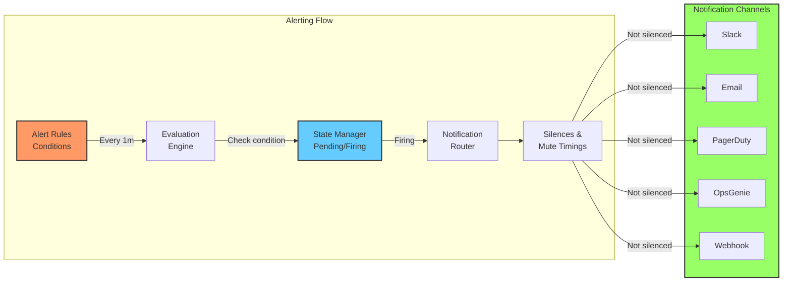
```mermaid
graph LR
    subgraph AlertFlow["Alerting Flow"]
        RULE[Alert Rules<br/>Conditions]
        EVAL[Evaluation<br/>Engine]
        STATE[State Manager<br/>Pending/Firing]
        ROUTE[Notification<br/>Router]
        SILENCE[Silences &<br/>Mute Timings]
    end
    
    subgraph Channels["Notification Channels"]
        SLACK[Slack]
        EMAIL[Email]
        PAGER[PagerDuty]
        OPS[OpsGenie]
        WEBHOOK[Webhook]
    end
    
    RULE -->|Every 1m| EVAL
    EVAL -->|Check condition| STATE
    STATE -->|Firing| ROUTE
    ROUTE --> SILENCE
    SILENCE -->|Not silenced| SLACK
    SILENCE -->|Not silenced| EMAIL
    SILENCE -->|Not silenced| PAGER
    SILENCE -->|Not silenced| OPS
    SILENCE -->|Not silenced| WEBHOOK
    
    style RULE fill:#f96,stroke:#333,stroke-width:2px
    style STATE fill:#6cf,stroke:#333,stroke-width:2px
    style Channels fill:#9f6,stroke:#333,stroke-width:2px
```

---

## 4. Grafana Tempo

### 4.1 Giới thiệu

**Grafana Tempo** là distributed tracing backend:
- High-scale, cost-effective
- Chỉ cần object storage
- Tương thích Jaeger, Zipkin, OpenTelemetry
- Không cần index, search by trace ID

### 4.2 Distributed Tracing Concepts

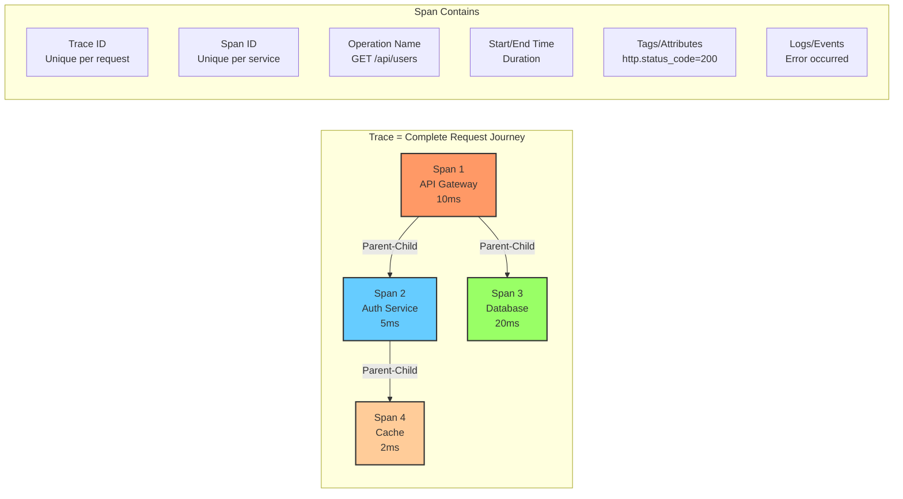
```mermaid
graph LR
    subgraph Trace["Trace = Complete Request Journey"]
        SPAN1[Span 1<br/>API Gateway<br/>10ms]
        SPAN2[Span 2<br/>Auth Service<br/>5ms]
        SPAN3[Span 3<br/>Database<br/>20ms]
        SPAN4[Span 4<br/>Cache<br/>2ms]
    end
    
    SPAN1 -->|Parent-Child| SPAN2
    SPAN1 -->|Parent-Child| SPAN3
    SPAN2 -->|Parent-Child| SPAN4
    
    subgraph SpanData["Span Contains"]
        DATA1[Trace ID<br/>Unique per request]
        DATA2[Span ID<br/>Unique per service]
        DATA3[Operation Name<br/>GET /api/users]
        DATA4[Start/End Time<br/>Duration]
        DATA5[Tags/Attributes<br/>http.status_code=200]
        DATA6[Logs/Events<br/>Error occurred]
    end
    
    style SPAN1 fill:#f96,stroke:#333,stroke-width:2px
    style SPAN2 fill:#6cf,stroke:#333,stroke-width:2px
    style SPAN3 fill:#9f6,stroke:#333,stroke-width:2px
    style SPAN4 fill:#fc9,stroke:#333,stroke-width:2px
```

### 4.3 Tempo Architecture

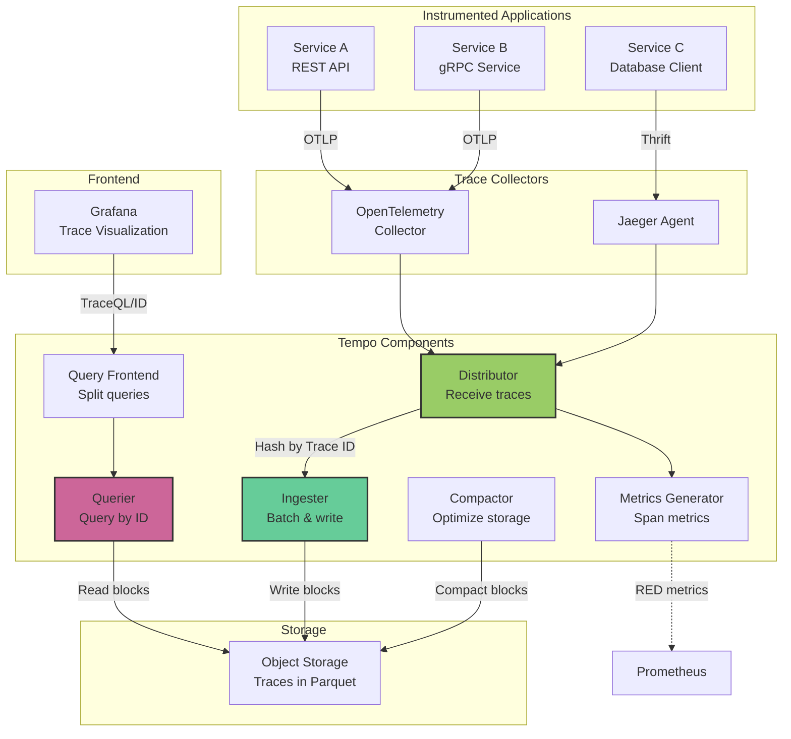
```mermaid
graph TB
    subgraph Applications["Instrumented Applications"]
        APP1[Service A<br/>REST API]
        APP2[Service B<br/>gRPC Service]
        APP3[Service C<br/>Database Client]
    end
    
    subgraph Collectors["Trace Collectors"]
        OTEL[OpenTelemetry<br/>Collector]
        JAEGER[Jaeger Agent]
    end
    
    subgraph TempoComponents["Tempo Components"]
        DIST[Distributor<br/>Receive traces]
        ING[Ingester<br/>Batch & write]
        QUERY[Querier<br/>Query by ID]
        QF[Query Frontend<br/>Split queries]
        COMP[Compactor<br/>Optimize storage]
        METRICS[Metrics Generator<br/>Span metrics]
    end
    
    subgraph Storage["Storage"]
        S3[Object Storage<br/>Traces in Parquet]
    end
    
    subgraph Frontend
        GRAFANA[Grafana<br/>Trace Visualization]
    end
    
    APP1 -->|OTLP| OTEL
    APP2 -->|OTLP| OTEL
    APP3 -->|Thrift| JAEGER
    
    OTEL --> DIST
    JAEGER --> DIST
    
    DIST -->|Hash by Trace ID| ING
    DIST --> METRICS
    ING -->|Write blocks| S3
    COMP -->|Compact blocks| S3
    
    GRAFANA -->|TraceQL/ID| QF
    QF --> QUERY
    QUERY -->|Read blocks| S3
    
    METRICS -.->|RED metrics| PROMETHEUS[Prometheus]
    
    style DIST fill:#9c6,stroke:#333,stroke-width:2px
    style ING fill:#6c9,stroke:#333,stroke-width:2px
    style QUERY fill:#c69,stroke:#333,stroke-width:2px
```

### 4.4 Tempo Data Flow

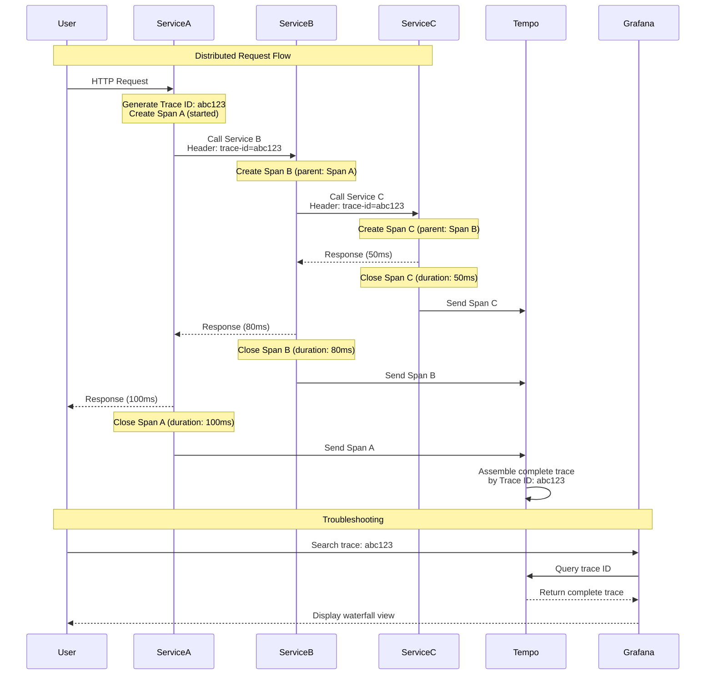
```mermaid
sequenceDiagram
    participant User
    participant ServiceA
    participant ServiceB
    participant ServiceC
    participant Tempo
    participant Grafana
    
    Note over User,ServiceC: Distributed Request Flow
    User->>ServiceA: HTTP Request
    Note over ServiceA: Generate Trace ID: abc123<br/>Create Span A (started)
    
    ServiceA->>ServiceB: Call Service B<br/>Header: trace-id=abc123
    Note over ServiceB: Create Span B (parent: Span A)
    
    ServiceB->>ServiceC: Call Service C<br/>Header: trace-id=abc123
    Note over ServiceC: Create Span C (parent: Span B)
    
    ServiceC-->>ServiceB: Response (50ms)
    Note over ServiceC: Close Span C (duration: 50ms)
    ServiceC->>Tempo: Send Span C
    
    ServiceB-->>ServiceA: Response (80ms)
    Note over ServiceB: Close Span B (duration: 80ms)
    ServiceB->>Tempo: Send Span B
    
    ServiceA-->>User: Response (100ms)
    Note over ServiceA: Close Span A (duration: 100ms)
    ServiceA->>Tempo: Send Span A
    
    Tempo->>Tempo: Assemble complete trace<br/>by Trace ID: abc123
    
    Note over User,Grafana: Troubleshooting
    User->>Grafana: Search trace: abc123
    Grafana->>Tempo: Query trace ID
    Tempo-->>Grafana: Return complete trace
    Grafana-->>User: Display waterfall view
```

### 4.5 TraceQL Query Language

**TraceQL** cho phép query traces theo attributes:

```traceql
# Find slow traces
{ duration > 100ms }

# Find error traces
{ status = error }

# Filter by service and operation
{ service.name = "checkout" && name = "place-order" }

# Complex queries
{ span.http.status_code >= 400 && duration > 1s }

# Resource attributes
{ resource.service.name = "api" && resource.environment = "prod" }
```

### 4.6 Span Metrics (RED Metrics)

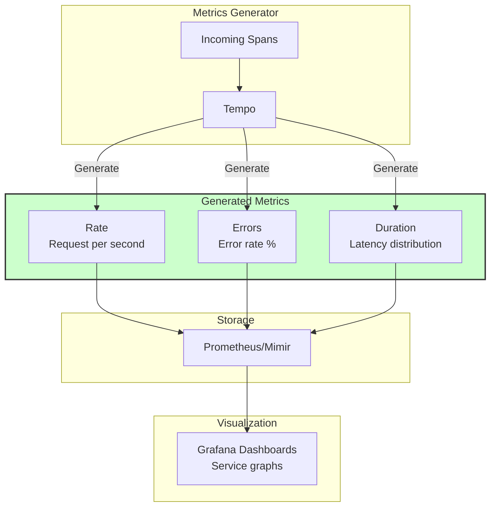
```mermaid
graph TB
    subgraph SpanMetrics["Metrics Generator"]
        TEMPO[Tempo]
        SPANS[Incoming Spans]
    end
    
    subgraph GeneratedMetrics["Generated Metrics"]
        RATE[Rate<br/>Request per second]
        ERROR[Errors<br/>Error rate %]
        DURATION[Duration<br/>Latency distribution]
    end
    
    subgraph Storage
        PROM[Prometheus/Mimir]
    end
    
    subgraph Visualization
        GRAF[Grafana Dashboards<br/>Service graphs]
    end
    
    SPANS --> TEMPO
    TEMPO -->|Generate| RATE
    TEMPO -->|Generate| ERROR
    TEMPO -->|Generate| DURATION
    
    RATE --> PROM
    ERROR --> PROM
    DURATION --> PROM
    
    PROM --> GRAF
    
    style GeneratedMetrics fill:#cfc,stroke:#333,stroke-width:2px
```

---

## 5. Grafana Mimir

### 5.1 Giới thiệu

**Grafana Mimir** là long-term storage cho Prometheus metrics:
- Horizontally scalable (billions of series)
- Multi-tenancy built-in
- Cost-effective với object storage
- 100% Prometheus compatible

### 5.2 Mimir Architecture

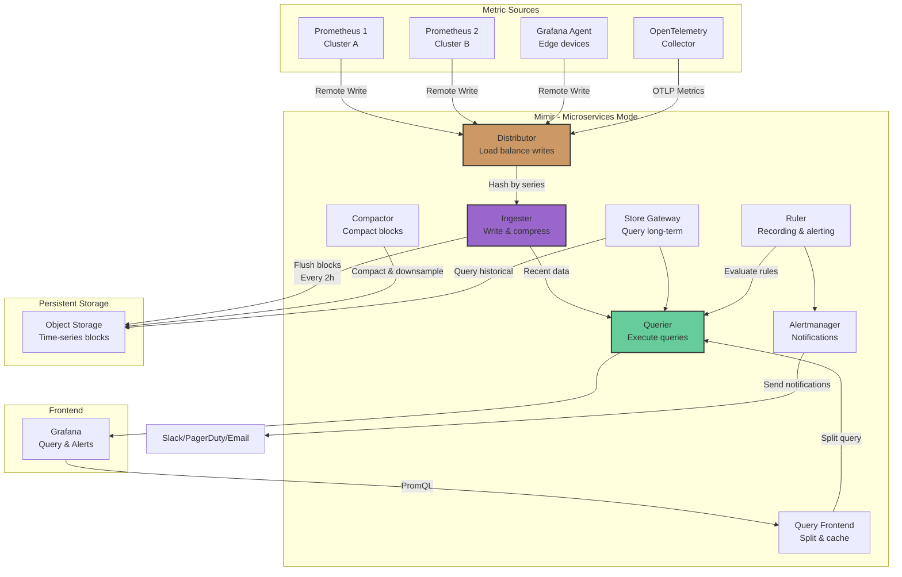
```mermaid
graph TB
    subgraph Scrapers["Metric Sources"]
        PROM1[Prometheus 1<br/>Cluster A]
        PROM2[Prometheus 2<br/>Cluster B]
        AGENT[Grafana Agent<br/>Edge devices]
        OTEL[OpenTelemetry<br/>Collector]
    end
    
    subgraph MimirComponents["Mimir - Microservices Mode"]
        DIST[Distributor<br/>Load balance writes]
        ING[Ingester<br/>Write & compress]
        QUERY[Querier<br/>Execute queries]
        QF[Query Frontend<br/>Split & cache]
        STORE[Store Gateway<br/>Query long-term]
        COMP[Compactor<br/>Compact blocks]
        RULER[Ruler<br/>Recording & alerting]
        ALERT[Alertmanager<br/>Notifications]
    end
    
    subgraph Storage["Persistent Storage"]
        S3[Object Storage<br/>Time-series blocks]
    end
    
    subgraph Frontend
        GRAFANA[Grafana<br/>Query & Alerts]
    end
    
    PROM1 -->|Remote Write| DIST
    PROM2 -->|Remote Write| DIST
    AGENT -->|Remote Write| DIST
    OTEL -->|OTLP Metrics| DIST
    
    DIST -->|Hash by series| ING
    ING -->|Recent data| QUERY
    ING -->|Flush blocks<br/>Every 2h| S3
    
    COMP -->|Compact & downsample| S3
    STORE -->|Query historical| S3
    STORE --> QUERY
    
    GRAFANA -->|PromQL| QF
    QF -->|Split query| QUERY
    QUERY --> GRAFANA
    
    RULER -->|Evaluate rules| QUERY
    RULER --> ALERT
    ALERT -->|Send notifications| EXTERNAL[Slack/PagerDuty/Email]
    
    style DIST fill:#c96,stroke:#333,stroke-width:2px
    style ING fill:#96c,stroke:#333,stroke-width:2px
    style QUERY fill:#6c9,stroke:#333,stroke-width:2px
```

### 5.3 Mimir Write Path (Chi tiết)

```mermaid
graph TB
    subgraph WritePath["Write Path - Detail"]
        PROM[Prometheus<br/>Scrape metrics]
        
        subgraph Distributor["Distributor Layer"]
            DIST1[Distributor 1]
            DIST2[Distributor 2]
            DIST3[Distributor 3]
        end
        
        subgraph IngesterRing["Ingester Ring (Hash Ring)"]
            ING1[Ingester 1<br/>Tenant A, Series 1-1000]
            ING2[Ingester 2<br/>Tenant A, Series 1001-2000]
            ING3[Ingester 3<br/>Tenant B, Series 1-1000]
        end
        
        subgraph Storage
            S3[Object Storage]
        end
    end
    
    PROM -->|Remote Write| DIST1
    PROM -->|Remote Write| DIST2
    
    DIST1 -->|Hash(tenant_id + series)| ING1
    DIST1 -->|Hash(tenant_id + series)| ING2
    DIST2 -->|Hash(tenant_id + series)| ING1
    DIST2 -->|Hash(tenant_id + series)| ING3
    
    ING1 -->|Flush block every 2h| S3
    ING2 -->|Flush block every 2h| S3
    ING3 -->|Flush block every 2h| S3
    
    Note1[Replication Factor = 3<br/>Each sample written to 3 ingesters]
    
    style DIST1 fill:#f96,stroke:#333,stroke-width:2px
    style ING1 fill:#6cf,stroke:#333,stroke-width:2px
    style ING2 fill:#6cf,stroke:#333,stroke-width:2px
    style ING3 fill:#6cf,stroke:#333,stroke-width:2px
```

### 5.4 Mimir Read Path (Chi tiết)

```mermaid
graph TB
    subgraph ReadPath["Read Path - Query Execution"]
        GRAFANA[Grafana]
        
        subgraph QueryFrontend["Query Frontend"]
            QF[Query Frontend<br/>Split & cache]
            CACHE[Results Cache<br/>Redis/Memcached]
        end
        
        subgraph Queriers["Querier Pool"]
            Q1[Querier 1]
            Q2[Querier 2]
            Q3[Querier 3]
        end
        
        subgraph DataSources["Data Sources"]
            ING_READ[Ingesters<br/>Last 2h in memory]
            STORE[Store Gateway<br/>Historical blocks]
            S3[Object Storage]
        end
    end
    
    GRAFANA -->|PromQL: rate(requests[5m])| QF
    QF -->|Check cache| CACHE
    CACHE -.->|Cache miss| QF
    QF -->|Split by time range| Q1
    QF -->|Split by time range| Q2
    QF -->|Split by time range| Q3
    
    Q1 -->|Query recent| ING_READ
    Q2 -->|Query historical| STORE
    Q3 -->|Query historical| STORE
    
    STORE -->|Fetch blocks| S3
    
    Q1 -->|Partial results| QF
    Q2 -->|Partial results| QF
    Q3 -->|Partial results| QF
    
    QF -->|Merge & aggregate| CACHE
    CACHE -->|Store result| QF
    QF --> GRAFANA
    
    style QF fill:#9f6,stroke:#333,stroke-width:2px
    style Q1 fill:#6c9,stroke:#333,stroke-width:2px
    style Q2 fill:#6c9,stroke:#333,stroke-width:2px
    style Q3 fill:#6c9,stroke:#333,stroke-width:2px
```

### 5.5 Mimir Compaction Process

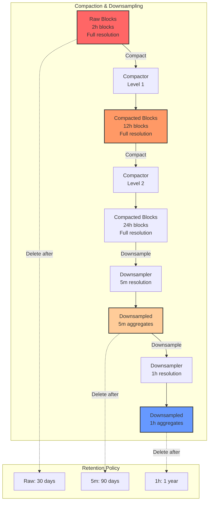
```mermaid
graph TB
    subgraph CompactionFlow["Compaction & Downsampling"]
        RAW[Raw Blocks<br/>2h blocks<br/>Full resolution]
        
        COMP1[Compactor<br/>Level 1]
        L1[Compacted Blocks<br/>12h blocks<br/>Full resolution]
        
        COMP2[Compactor<br/>Level 2]
        L2[Compacted Blocks<br/>24h blocks<br/>Full resolution]
        
        DOWN1[Downsampler<br/>5m resolution]
        D1[Downsampled<br/>5m aggregates]
        
        DOWN2[Downsampler<br/>1h resolution]
        D2[Downsampled<br/>1h aggregates]
    end
    
    subgraph Retention["Retention Policy"]
        R1[Raw: 30 days]
        R2[5m: 90 days]
        R3[1h: 1 year]
    end
    
    RAW -->|Compact| COMP1
    COMP1 --> L1
    L1 -->|Compact| COMP2
    COMP2 --> L2
    
    L2 -->|Downsample| DOWN1
    DOWN1 --> D1
    D1 -->|Downsample| DOWN2
    DOWN2 --> D2
    
    RAW -.->|Delete after| R1
    D1 -.->|Delete after| R2
    D2 -.->|Delete after| R3
    
    style RAW fill:#f66,stroke:#333,stroke-width:2px
    style L1 fill:#f96,stroke:#333,stroke-width:2px
    style D1 fill:#fc9,stroke:#333,stroke-width:2px
    style D2 fill:#69f,stroke:#333,stroke-width:2px
```

### 5.6 Multi-tenancy in Mimir

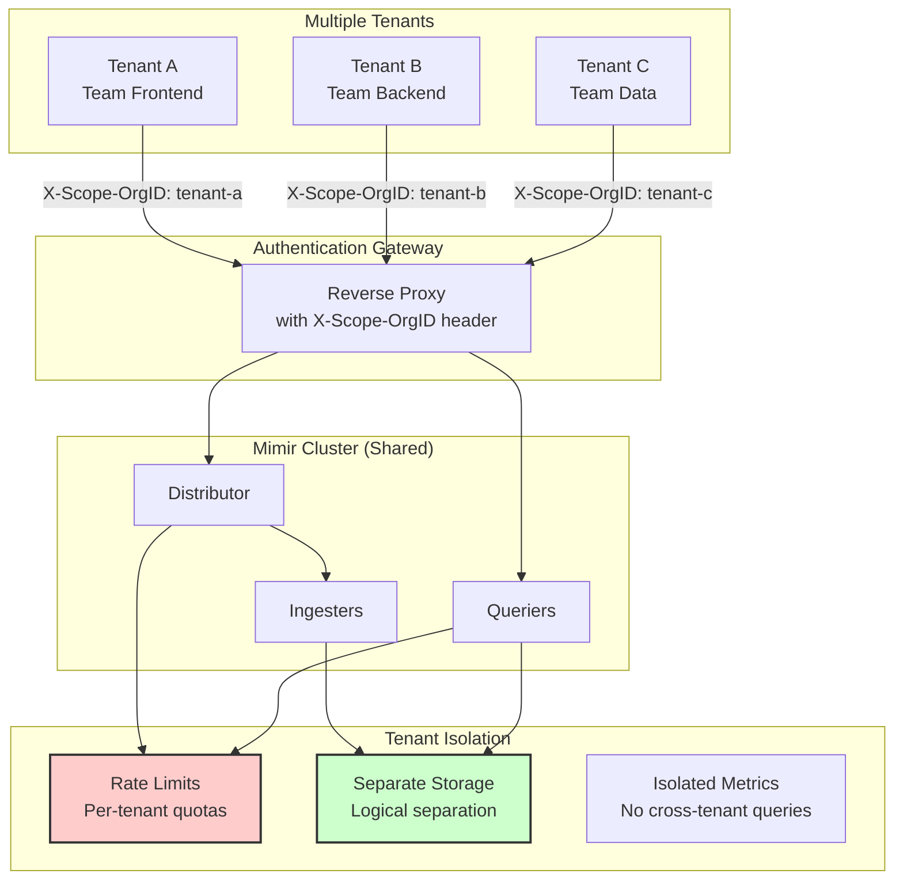
```mermaid
graph TB
    subgraph Tenants["Multiple Tenants"]
        T1[Tenant A<br/>Team Frontend]
        T2[Tenant B<br/>Team Backend]
        T3[Tenant C<br/>Team Data]
    end
    
    subgraph Auth["Authentication Gateway"]
        PROXY[Reverse Proxy<br/>with X-Scope-OrgID header]
    end
    
    subgraph Mimir["Mimir Cluster (Shared)"]
        DIST[Distributor]
        ING[Ingesters]
        QUERY[Queriers]
    end
    
    subgraph Isolation["Tenant Isolation"]
        LIMIT[Rate Limits<br/>Per-tenant quotas]
        STORAGE[Separate Storage<br/>Logical separation]
        METRICS[Isolated Metrics<br/>No cross-tenant queries]
    end
    
    T1 -->|X-Scope-OrgID: tenant-a| PROXY
    T2 -->|X-Scope-OrgID: tenant-b| PROXY
    T3 -->|X-Scope-OrgID: tenant-c| PROXY
    
    PROXY --> DIST
    DIST --> ING
    ING --> STORAGE
    
    PROXY --> QUERY
    QUERY --> STORAGE
    
    DIST --> LIMIT
    QUERY --> LIMIT
    
    style LIMIT fill:#fcc,stroke:#333,stroke-width:2px
    style STORAGE fill:#cfc,stroke:#333,stroke-width:2px
```

---

## 6. Mô hình triển khai

### 6.1 Monolithic Mode (Development/Small Scale)

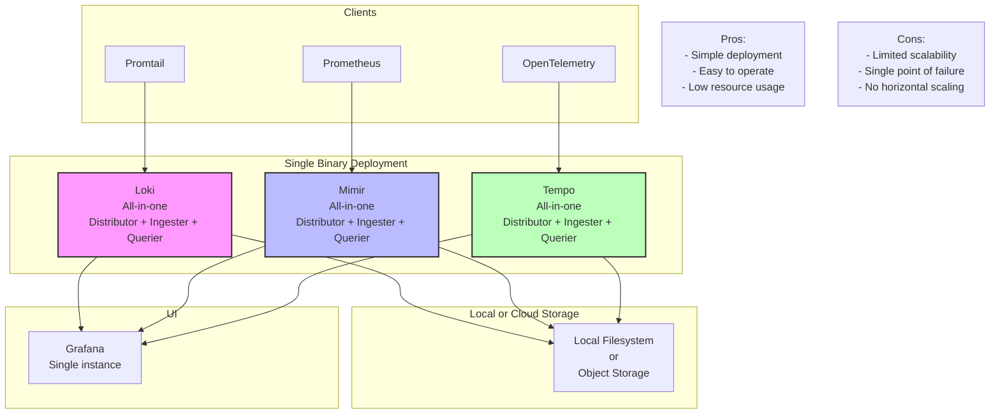
```mermaid
graph TB
    subgraph Clients["Clients"]
        PROMTAIL[Promtail]
        PROM[Prometheus]
        OTEL[OpenTelemetry]
    end
    
    subgraph Monolithic["Single Binary Deployment"]
        LOKI_MONO[Loki<br/>All-in-one<br/>Distributor + Ingester + Querier]
        MIMIR_MONO[Mimir<br/>All-in-one<br/>Distributor + Ingester + Querier]
        TEMPO_MONO[Tempo<br/>All-in-one<br/>Distributor + Ingester + Querier]
    end
    
    subgraph Storage["Local or Cloud Storage"]
        LOCAL[Local Filesystem<br/>or<br/>Object Storage]
    end
    
    subgraph UI
        GRAFANA[Grafana<br/>Single instance]
    end
    
    PROMTAIL --> LOKI_MONO
    PROM --> MIMIR_MONO
    OTEL --> TEMPO_MONO
    
    LOKI_MONO --> LOCAL
    MIMIR_MONO --> LOCAL
    TEMPO_MONO --> LOCAL
    
    LOKI_MONO --> GRAFANA
    MIMIR_MONO --> GRAFANA
    TEMPO_MONO --> GRAFANA
    
    Note1[Pros:<br/>- Simple deployment<br/>- Easy to operate<br/>- Low resource usage]
    Note2[Cons:<br/>- Limited scalability<br/>- Single point of failure<br/>- No horizontal scaling]
    
    style LOKI_MONO fill:#f9f,stroke:#333,stroke-width:2px
    style MIMIR_MONO fill:#bbf,stroke:#333,stroke-width:2px
    style TEMPO_MONO fill:#bfb,stroke:#333,stroke-width:2px
```

### 6.2 Microservices Mode (Production/Large Scale)

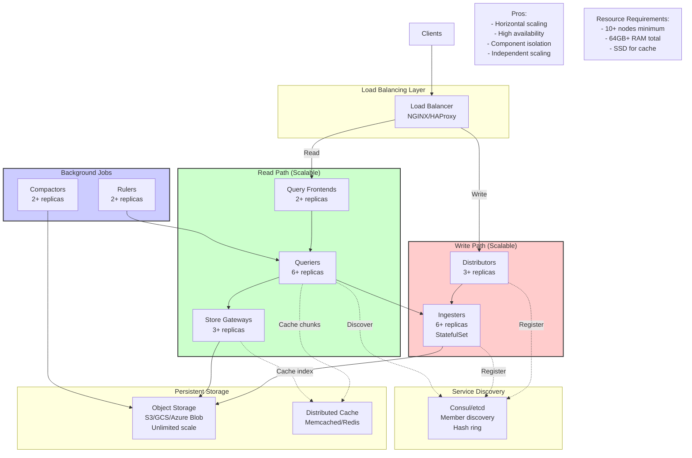
```mermaid
graph TB
    subgraph LoadBalancing["Load Balancing Layer"]
        LB[Load Balancer<br/>NGINX/HAProxy]
    end
    
    subgraph WriteComponents["Write Path (Scalable)"]
        DIST1[Distributors<br/>3+ replicas]
        ING1[Ingesters<br/>6+ replicas<br/>StatefulSet]
    end
    
    subgraph ReadComponents["Read Path (Scalable)"]
        QF1[Query Frontends<br/>2+ replicas]
        QUERY1[Queriers<br/>6+ replicas]
        STORE1[Store Gateways<br/>3+ replicas]
    end
    
    subgraph BackendComponents["Background Jobs"]
        COMP1[Compactors<br/>2+ replicas]
        RULER1[Rulers<br/>2+ replicas]
    end
    
    subgraph Storage["Persistent Storage"]
        S3[Object Storage<br/>S3/GCS/Azure Blob<br/>Unlimited scale]
        CACHE[Distributed Cache<br/>Memcached/Redis]
    end
    
    subgraph Coordination["Service Discovery"]
        CONSUL[Consul/etcd<br/>Member discovery<br/>Hash ring]
    end
    
    CLIENT[Clients] --> LB
    LB -->|Write| DIST1
    LB -->|Read| QF1
    
    DIST1 --> ING1
    ING1 --> S3
    
    QF1 --> QUERY1
    QUERY1 --> STORE1
    QUERY1 --> ING1
    STORE1 --> S3
    
    COMP1 --> S3
    RULER1 --> QUERY1
    
    QUERY1 -.->|Cache chunks| CACHE
    STORE1 -.->|Cache index| CACHE
    
    DIST1 -.->|Register| CONSUL
    ING1 -.->|Register| CONSUL
    QUERY1 -.->|Discover| CONSUL
    
    Note1[Pros:<br/>- Horizontal scaling<br/>- High availability<br/>- Component isolation<br/>- Independent scaling]
    Note2[Resource Requirements:<br/>- 10+ nodes minimum<br/>- 64GB+ RAM total<br/>- SSD for cache]
    
    style WriteComponents fill:#fcc,stroke:#333,stroke-width:2px
    style ReadComponents fill:#cfc,stroke:#333,stroke-width:2px
    style BackendComponents fill:#ccf,stroke:#333,stroke-width:2px
```

### 6.3 Hybrid Mode (Balanced Approach)

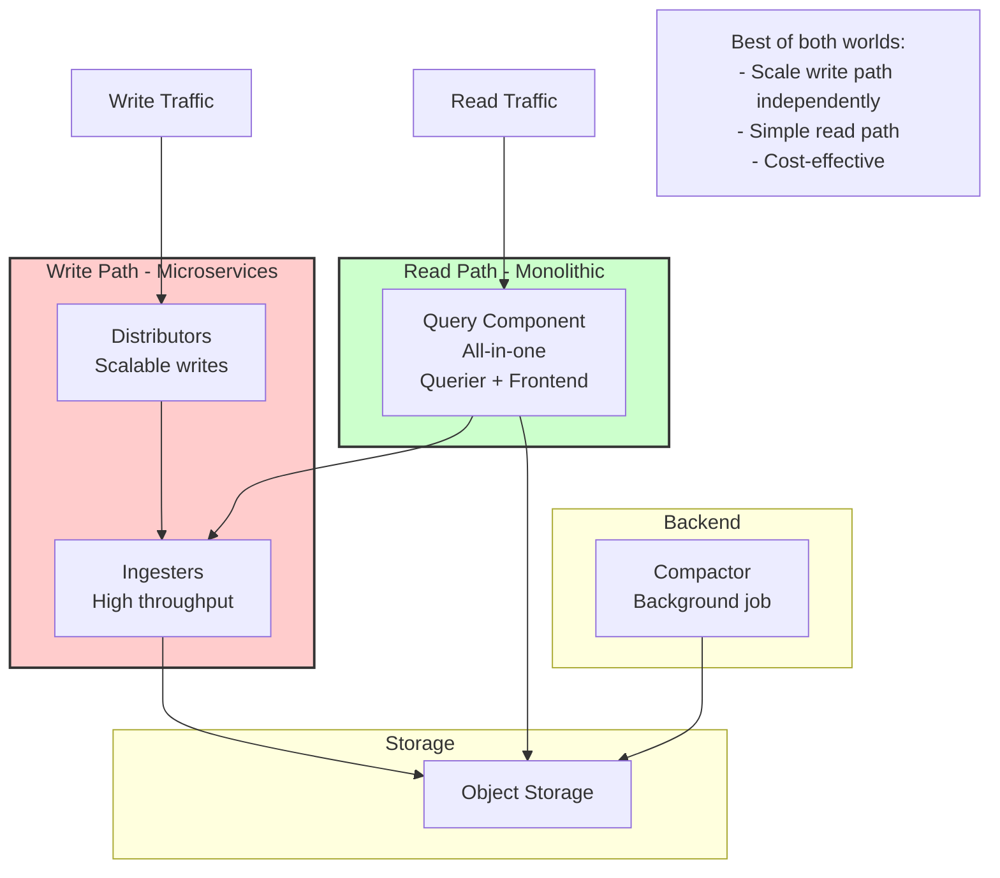
```mermaid
graph TB
    subgraph WritePathMicro["Write Path - Microservices"]
        DIST[Distributors<br/>Scalable writes]
        ING[Ingesters<br/>High throughput]
    end
    
    subgraph ReadPathMono["Read Path - Monolithic"]
        QUERY_MONO[Query Component<br/>All-in-one<br/>Querier + Frontend]
    end
    
    subgraph Storage
        S3[Object Storage]
    end
    
    subgraph Backend
        COMP[Compactor<br/>Background job]
    end
    
    WRITE[Write Traffic] --> DIST
    DIST --> ING
    ING --> S3
    
    READ[Read Traffic] --> QUERY_MONO
    QUERY_MONO --> ING
    QUERY_MONO --> S3
    
    COMP --> S3
    
    Note1[Best of both worlds:<br/>- Scale write path independently<br/>- Simple read path<br/>- Cost-effective]
    
    style WritePathMicro fill:#fcc,stroke:#333,stroke-width:2px
    style ReadPathMono fill:#cfc,stroke:#333,stroke-width:2px
```

### 6.4 Kubernetes Deployment Architecture

```mermaid
graph TB
    subgraph K8s["Kubernetes Cluster"]
        subgraph Namespace1["loki-system Namespace"]
            LOKI_DIST[Loki Distributor<br/>Deployment: 3 replicas]
            LOKI_ING[Loki Ingester<br/>StatefulSet: 6 replicas]
            LOKI_QUERY[Loki Querier<br/>Deployment: 3 replicas]
            LOKI_QF[Loki Query Frontend<br/>Deployment: 2 replicas]
            LOKI_SVC[Service<br/>loki-distributor<br/>loki-querier]
        end
        
        subgraph Namespace2["mimir-system Namespace"]
            MIMIR_DIST[Mimir Distributor<br/>Deployment: 3 replicas]
            MIMIR_ING[Mimir Ingester<br/>StatefulSet: 9 replicas]
            MIMIR_QUERY[Mimir Querier<br/>Deployment: 6 replicas]
            MIMIR_STORE[Mimir Store Gateway<br/>StatefulSet: 3 replicas]
            MIMIR_SVC[Service<br/>mimir-distributor<br/>mimir-querier]
        end
        
        subgraph Namespace3["tempo-system Namespace"]
            TEMPO_DIST[Tempo Distributor<br/>Deployment: 3 replicas]
            TEMPO_ING[Tempo Ingester<br/>StatefulSet: 6 replicas]
            TEMPO_QUERY[Tempo Querier<br/>Deployment: 3 replicas]
            TEMPO_SVC[Service<br/>tempo-distributor<br/>tempo-querier]
        end
        
        subgraph Namespace4["monitoring Namespace"]
            GRAFANA_POD[Grafana<br/>Deployment: 2 replicas]
            PROM_POD[Prometheus<br/>StatefulSet: 2 replicas]
            ALERT_POD[Alertmanager<br/>StatefulSet: 3 replicas]
        end
        
        subgraph Storage["Storage Layer"]
            PV[PersistentVolumes<br/>SSD for cache/WAL]
            SC_S3[S3 StorageClass<br/>CSI Driver]
        end
        
        subgraph Ingress["Ingress Layer"]
            NGINX[NGINX Ingress<br/>TLS Termination]
            CERT[Cert Manager<br/>Let's Encrypt]
        end
    end
    
    subgraph External["External Resources"]
        S3_BUCKET[S3 Bucket<br/>Long-term storage]
        DNS[Route53/CloudDNS<br/>DNS management]
    end
    
    NGINX --> GRAFANA_POD
    NGINX --> LOKI_SVC
    NGINX --> MIMIR_SVC
    
    LOKI_ING --> PV
    MIMIR_ING --> PV
    TEMPO_ING --> PV
    
    LOKI_ING --> S3_BUCKET
    MIMIR_ING --> S3_BUCKET
    TEMPO_ING --> S3_BUCKET
    
    GRAFANA_POD --> LOKI_QUERY
    GRAFANA_POD --> MIMIR_QUERY
    GRAFANA_POD --> TEMPO_QUERY
    
    CERT -.-> NGINX
    DNS -.-> NGINX
    
    style Namespace1 fill:#fcc,stroke:#333,stroke-width:2px
    style Namespace2 fill:#cfc,stroke:#333,stroke-width:2px
    style Namespace3 fill:#ccf,stroke:#333,stroke-width:2px
    style Namespace4 fill:#ffc,stroke:#333,stroke-width:2px
```

---

## 7. Integration Patterns

### 7.1 Logs, Metrics, Traces Correlation

```mermaid
graph TB
    subgraph Application["Application Layer"]
        APP[Microservice<br/>with Instrumentation]
    end
    
    subgraph Signals["Three Signals"]
        APP -->|Structured Logs<br/>+ trace_id| LOGS[Log Entries]
        APP -->|Metrics<br/>+ Exemplars| METRICS[Time Series]
        APP -->|Spans<br/>with attributes| TRACES[Distributed Traces]
    end
    
    subgraph Storage["Storage Backends"]
        LOGS --> LOKI[Loki<br/>Index: trace_id label]
        METRICS --> MIMIR[Mimir<br/>Exemplars point to traces]
        TRACES --> TEMPO[Tempo<br/>Spans with trace_id]
    end
    
    subgraph Grafana["Unified Grafana Interface"]
        DASHBOARD[Dashboard<br/>Metrics overview]
        EXPLORE[Explore<br/>Deep dive]
        TRACE_VIEW[Trace View<br/>Waterfall diagram]
        LOG_VIEW[Logs Panel<br/>Filtered by trace_id]
    end
    
    LOKI --> DASHBOARD
    MIMIR --> DASHBOARD
    TEMPO --> DASHBOARD
    
    LOKI --> EXPLORE
    MIMIR --> EXPLORE
    TEMPO --> EXPLORE
    
    DASHBOARD -.->|Click exemplar| TRACE_VIEW
    TRACE_VIEW -.->|Extract trace_id| LOG_VIEW
    LOG_VIEW -.->|Related logs| EXPLORE
    EXPLORE -.->|Jump to span| TRACE_VIEW
    
    MIMIR -.->|Exemplars link| TEMPO
    LOKI -.->|Derived fields| TEMPO
    
    style APP fill:#f96,stroke:#333,stroke-width:2px
    style Grafana fill:#fb9,stroke:#333,stroke-width:3px
```

### 7.2 Correlation Implementation

```mermaid
sequenceDiagram
    participant App as Application
    participant Log as Log Entry
    participant Metric as Metric Point
    participant Span as Trace Span
    participant User as User/SRE
    participant Grafana
    
    Note over App: Incoming HTTP Request
    App->>App: Generate trace_id: abc123
    
    App->>Span: Create span with trace_id
    App->>Metric: Record metric with exemplar<br/>trace_id=abc123
    App->>Log: Write log with trace_id field<br/>{trace_id: "abc123", msg: "error"}
    
    Note over User,Grafana: Troubleshooting Workflow
    
    User->>Grafana: View dashboard
    Grafana->>Grafana: Show metrics graph
    Note over Grafana: Spike in error rate detected
    
    User->>Grafana: Click on metric point
    Grafana->>Grafana: Find exemplar (trace_id: abc123)
    Grafana->>Tempo: Query trace abc123
    Tempo-->>Grafana: Return trace spans
    
    User->>Grafana: Click "View Logs" in trace
    Grafana->>Loki: Query logs with trace_id=abc123
    Loki-->>Grafana: Return related log entries
    
    Note over User: Full context:<br/>Metric → Trace → Logs
```

### 7.3 Troubleshooting Workflow

```mermaid
graph TB
    START[🚨 Alert Triggered<br/>High Error Rate]
    
    START --> DASH[📊 Step 1: View Dashboard<br/>Check metrics in Grafana]
    DASH --> METRICS{📈 Analyze Metrics<br/>What's the pattern?}
    
    METRICS -->|Sudden spike| EXEMPLAR[🔍 Step 2: Click Exemplar<br/>View sample trace]
    METRICS -->|Gradual increase| QUERY[📊 Query time range<br/>Compare with baseline]
    
    EXEMPLAR --> TRACE[🔗 Step 3: Analyze Trace<br/>in Tempo]
    TRACE --> SPAN{Which span is slow?}
    
    SPAN -->|Database query| DB_LOGS[📋 Step 4: Check DB logs<br/>Filter by trace_id in Loki]
    SPAN -->|External API| API_LOGS[📋 Check API logs<br/>Filter by trace_id]
    SPAN -->|Business logic| APP_LOGS[📋 Check app logs<br/>Filter by trace_id]
    
    DB_LOGS --> ROOT[✅ Root Cause Found<br/>Slow query identified]
    API_LOGS --> ROOT
    APP_LOGS --> ROOT
    
    QUERY --> COMPARE[Compare metrics:<br/>- Current vs baseline<br/>- Different services]
    COMPARE --> CORRELATE[Look for correlated<br/>metrics]
    CORRELATE --> TRACE
    
    ROOT --> ACTION[🔧 Take Action<br/>Fix & Deploy]
    ACTION --> VERIFY[✓ Verify Fix<br/>Monitor metrics]
    
    style START fill:#f66,stroke:#333,stroke-width:3px
    style ROOT fill:#6f6,stroke:#333,stroke-width:3px
    style ACTION fill:#66f,stroke:#333,stroke-width:2px
```

### 7.4 Data Flow with Correlation

```mermaid
graph LR
    subgraph Source["1. Data Generation"]
        REQ[HTTP Request<br/>trace_id: abc123]
    end
    
    subgraph Instrumentation["2. Instrumentation"]
        OTEL[OpenTelemetry SDK]
        OTEL -->|Logs| LOG_EXP[Log Exporter]
        OTEL -->|Metrics| MET_EXP[Metrics Exporter]
        OTEL -->|Traces| TRC_EXP[Trace Exporter]
    end
    
    subgraph Backend["3. Storage Backends"]
        LOG_EXP --> LOKI[Loki<br/>{trace_id="abc123"}]
        MET_EXP --> MIMIR[Mimir<br/>exemplar: abc123]
        TRC_EXP --> TEMPO[Tempo<br/>span: abc123]
    end
    
    subgraph Correlation["4. Correlation"]
        LOKI -.->|Derived field| LINK1[trace_id → Tempo]
        MIMIR -.->|Exemplar| LINK2[metric → Tempo]
        TEMPO -.->|Context| LINK3[span → Loki]
    end
    
    subgraph UI["5. Unified View"]
        GRAFANA[Grafana Explorer<br/>Jump between signals]
    end
    
    REQ --> OTEL
    
    LINK1 --> GRAFANA
    LINK2 --> GRAFANA
    LINK3 --> GRAFANA
    
    style Source fill:#f96,stroke:#333,stroke-width:2px
    style Correlation fill:#9c6,stroke:#333,stroke-width:2px
    style UI fill:#fb9,stroke:#333,stroke-width:3px
```

---

## 8. Best Practices

### 8.1 Labels Strategy & Cardinality

```mermaid
graph TB
    subgraph Problem["❌ High Cardinality Problem"]
        BAD1[user_id as label<br/>1M users = 1M series]
        BAD2[request_id as label<br/>Every request unique]
        BAD3[timestamp as label<br/>Infinite cardinality]
        
        BAD1 --> IMPACT1[Index explosion]
        BAD2 --> IMPACT2[Memory overflow]
        BAD3 --> IMPACT3[Slow queries]
    end
    
    subgraph Solution["✅ Good Practices"]
        GOOD1[environment: prod/staging<br/>Low cardinality: 2-3 values]
        GOOD2[service: api/web/worker<br/>Medium cardinality: 10-50]
        GOOD3[status_code: 200/404/500<br/>Low cardinality: 10-20]
        
        GOOD1 --> BENEFIT1[Fast queries]
        GOOD2 --> BENEFIT2[Low storage cost]
        GOOD3 --> BENEFIT3[Easy to manage]
    end
    
    subgraph Alternative["Alternative for High Cardinality"]
        ALT1[Put in log content<br/>Not in labels]
        ALT2[Use LogQL/TraceQL filters<br/>Query-time filtering]
        ALT3[Aggregate metrics<br/>Summary/Histogram]
    end
    
    style Problem fill:#fcc,stroke:#333,stroke-width:2px
    style Solution fill:#cfc,stroke:#333,stroke-width:2px
    style Alternative fill:#ccf,stroke:#333,stroke-width:2px
```

### 8.2 Retention & Storage Tiers

```mermaid
graph TB
    subgraph DataLifecycle["Data Lifecycle Strategy"]
        INGEST[Ingested Data<br/>Full resolution]
        
        subgraph HotTier["Hot Tier (0-7 days)"]
            HOT[SSD Storage<br/>Full resolution<br/>Fast queries<br/>$$]
        end
        
        subgraph WarmTier["Warm Tier (7-30 days)"]
            WARM[Standard S3<br/>Full resolution<br/>Slower queries<br/>$]
        end
        
        subgraph ColdTier["Cold Tier (30-90 days)"]
            COLD1[S3 Infrequent Access<br/>Downsampled 5m<br/>Rare queries<br/>$]
        end
        
        subgraph Archive["Archive (90+ days)"]
            COLD2[S3 Glacier<br/>Downsampled 1h<br/>Compliance only<br/>¢]
        end
        
        subgraph Deleted["Retention Policy"]
            DELETE[Delete after 1 year<br/>Unless compliance required]
        end
    end
    
    INGEST --> HOT
    HOT -->|Age out| WARM
    WARM -->|Age out + Downsample| COLD1
    COLD1 -->|Age out + Downsample| COLD2
    COLD2 -->|Age out| DELETE
    
    Note1[Query Pattern:<br/>- 80% queries: last 24h Hot<br/>- 15% queries: last 7 days Warm<br/>- 5% queries: older Cold]
    
    style HOT fill:#f66,stroke:#333,stroke-width:2px
    style WARM fill:#f96,stroke:#333,stroke-width:2px
    style COLD1 fill:#fc9,stroke:#333,stroke-width:2px
    style COLD2 fill:#69f,stroke:#333,stroke-width:2px
```

### 8.3 High Availability Setup

```mermaid
graph TB
    subgraph MultiRegion["Multi-Region Deployment"]
        subgraph Region1["Region 1 / AZ-A"]
            LB1[Load Balancer 1]
            COMP1[Complete Stack<br/>Loki + Mimir + Tempo]
        end
        
        subgraph Region2["Region 2 / AZ-B"]
            LB2[Load Balancer 2]
            COMP2[Complete Stack<br/>Loki + Mimir + Tempo]
        end
        
        subgraph Region3["Region 3 / AZ-C"]
            LB3[Load Balancer 3]
            COMP3[Complete Stack<br/>Loki + Mimir + Tempo]
        end
    end
    
    subgraph Storage["Replicated Storage"]
        S3_PRIMARY[S3 Primary Region<br/>Cross-region replication]
        S3_BACKUP[S3 Backup Region<br/>Disaster recovery]
    end
    
    subgraph GlobalLB["Global Load Balancing"]
        DNS[GeoDNS/Global LB<br/>Route53/CloudFlare]
    end
    
    CLIENT[Clients] --> DNS
    DNS -->|Latency-based| LB1
    DNS -->|Latency-based| LB2
    DNS -->|Latency-based| LB3
    
    LB1 --> COMP1
    LB2 --> COMP2
    LB3 --> COMP3
    
    COMP1 --> S3_PRIMARY
    COMP2 --> S3_PRIMARY
    COMP3 --> S3_PRIMARY
    
    S3_PRIMARY -.->|Replicate| S3_BACKUP
    
    Note1[HA Characteristics:<br/>- RPO: < 1 minute<br/>- RTO: < 5 minutes<br/>- 99.99% uptime SLA]
    
    style Region1 fill:#fcc,stroke:#333,stroke-width:2px
    style Region2 fill:#cfc,stroke:#333,stroke-width:2px
    style Region3 fill:#ccf,stroke:#333,stroke-width:2px
```

### 8.4 Security Best Practices

```mermaid
graph TB
    subgraph SecurityLayers["Security Layers"]
        subgraph Network["Network Security"]
            FW[Firewall Rules<br/>Restrict IPs]
            VPC[VPC/Private Network<br/>Isolated subnets]
            TLS[TLS 1.3<br/>Encryption in transit]
        end
        
        subgraph Authentication["Authentication"]
            OAUTH[OAuth 2.0/OIDC<br/>SSO integration]
            APIKEY[API Keys<br/>Service accounts]
            MTLS[mTLS<br/>Service-to-service]
        end
        
        subgraph Authorization["Authorization"]
            RBAC[RBAC<br/>Role-based access]
            TENANT[Multi-tenancy<br/>Data isolation]
            QUOTA[Rate Limiting<br/>Resource quotas]
        end
        
        subgraph DataSecurity["Data Security"]
            ENCRYPT[Encryption at Rest<br/>S3 SSE-KMS]
            AUDIT[Audit Logs<br/>Access tracking]
            RETENTION[Data Retention<br/>GDPR compliance]
        end
    end
    
    subgraph Implementation
        USER[Users] --> OAUTH
        SERVICE[Services] --> MTLS
        
        OAUTH --> RBAC
        MTLS --> RBAC
        
        RBAC --> TENANT
        TENANT --> QUOTA
        
        QUOTA --> ENCRYPT
        ENCRYPT --> AUDIT
    end
    
    style Network fill:#fcc,stroke:#333,stroke-width:2px
    style Authentication fill:#cfc,stroke:#333,stroke-width:2px
    style Authorization fill:#ccf,stroke:#333,stroke-width:2px
    style DataSecurity fill:#ffc,stroke:#333,stroke-width:2px
```

### 8.5 Cost Optimization

```mermaid
graph TB
    subgraph Strategies["Cost Optimization Strategies"]
        subgraph Ingestion["1. Optimize Ingestion"]
            SAMPLE[Sampling<br/>Tail-based for traces]
            FILTER[Filtering<br/>Drop noisy logs]
            AGGREGATE[Pre-aggregation<br/>Recording rules]
        end
        
        subgraph Storage["2. Storage Optimization"]
            COMPRESS[Compression<br/>Snappy/Zstd]
            TIER[Tiered Storage<br/>Hot/Warm/Cold]
            LIFECYCLE[Lifecycle Policies<br/>Auto-delete old data]
        end
        
        subgraph Query["3. Query Optimization"]
            CACHE[Caching<br/>Results & chunks]
            LIMIT[Query Limits<br/>Prevent expensive queries]
            DOWNSAMPLE[Downsampling<br/>Lower resolution]
        end
        
        subgraph Infra["4. Infrastructure"]
            SPOT[Spot Instances<br/>Non-critical components]
            AUTOSCALE[Auto-scaling<br/>Match demand]
            RESERVED[Reserved Instances<br/>Predictable workloads]
        end
    end
    
    subgraph Results["Cost Savings"]
        SAMPLE --> SAVE1[50-70% ingestion cost]
        TIER --> SAVE2[60-80% storage cost]
        CACHE --> SAVE3[40-60% compute cost]
        SPOT --> SAVE4[50-70% infra cost]
    end
    
    style Ingestion fill:#fcc,stroke:#333,stroke-width:2px
    style Storage fill:#cfc,stroke:#333,stroke-width:2px
    style Query fill:#ccf,stroke:#333,stroke-width:2px
    style Infra fill:#ffc,stroke:#333,stroke-width:2px
```

### 8.6 Monitoring the Monitors

```mermaid
graph TB
    subgraph SelfMonitoring["Self-Monitoring Strategy"]
        subgraph Components["Monitor Components"]
            LOKI_M[Loki<br/>Export metrics]
            MIMIR_M[Mimir<br/>Export metrics]
            TEMPO_M[Tempo<br/>Export metrics]
        end
        
        subgraph MetaMonitoring["Meta-Monitoring Stack"]
            PROM_META[Prometheus<br/>Scrape component metrics]
            MIMIR_META[Mimir<br/>Store meta-metrics]
            GRAFANA_META[Grafana<br/>Meta-dashboards]
        end
        
        subgraph Alerts["Component Health Alerts"]
            ALERT1[Ingester down]
            ALERT2[High query latency]
            ALERT3[Storage full]
            ALERT4[Replication lag]
        end
    end
    
    LOKI_M --> PROM_META
    MIMIR_M --> PROM_META
    TEMPO_M --> PROM_META
    
    PROM_META --> MIMIR_META
    MIMIR_META --> GRAFANA_META
    
    GRAFANA_META --> ALERT1
    GRAFANA_META --> ALERT2
    GRAFANA_META --> ALERT3
    GRAFANA_META --> ALERT4
    
    ALERT1 --> ONCALL[On-Call Team]
    ALERT2 --> ONCALL
    ALERT3 --> ONCALL
    ALERT4 --> ONCALL
    
    Note1[Key Metrics to Monitor:<br/>- Write throughput/latency<br/>- Query latency p99<br/>- Error rates<br/>- Resource usage<br/>- Storage size/growth]
    
    style Components fill:#fcc,stroke:#333,stroke-width:2px
    style MetaMonitoring fill:#cfc,stroke:#333,stroke-width:2px
```

---

## 9. Performance Tuning

### 9.1 Query Optimization

```mermaid
graph TB
    subgraph QueryOptimization["Query Optimization Techniques"]
        subgraph TimeRange["1. Limit Time Range"]
            SMALL[Query small ranges<br/>Last 1h instead of 7d]
            RECENT[Prefer recent data<br/>Cached in memory]
        end
        
        subgraph Labels["2. Use Label Filters"]
            EXACT[Exact match first<br/>{service="api"}]
            REGEX[Avoid regex when possible<br/>Slower performance]
        end
        
        subgraph Content["3. Content Filtering"]
            EARLY[Filter early in pipeline<br/>|= "error" first]
            PARSE[Parse only when needed<br/>Expensive operation]
        end
        
        subgraph Aggregation["4. Aggregation"]
            RATE[Use rate() for counters<br/>Not raw values]
            TOPK[Use topk() for top N<br/>Not sort | limit]
        end
    end
    
    subgraph Results["Performance Impact"]
        SMALL --> FAST1[10x faster queries]
        EXACT --> FAST2[5x faster filtering]
        EARLY --> FAST3[3x faster processing]
        RATE --> FAST4[Efficient aggregation]
    end
    
    subgraph Examples["Query Examples"]
        BAD[❌ Bad Query:<br/>{job=~".*"} |~ "error.*"]
        GOOD[✅ Good Query:<br/>{job="api", env="prod"} |= "error"]
    end
    
    style TimeRange fill:#fcc,stroke:#333,stroke-width:2px
    style Labels fill:#cfc,stroke:#333,stroke-width:2px
    style Content fill:#ccf,stroke:#333,stroke-width:2px
```

### 9.2 Ingestion Optimization

```mermaid
graph TB
    subgraph IngestionFlow["Optimized Ingestion Pipeline"]
        subgraph Source["Data Source"]
            APP[Application Logs<br/>High volume]
        end
        
        subgraph Agent["Collection Agent"]
            BATCH[Batching<br/>Combine 100 logs]
            COMPRESS[Compression<br/>Gzip/Snappy]
            BUFFER[Buffer<br/>Memory queue]
        end
        
        subgraph Network["Network Transfer"]
            HTTP2[HTTP/2<br/>Multiplexing]
            RETRY[Retry Logic<br/>Exponential backoff]
        end
        
        subgraph Backend["Backend Processing"]
            DISTRIBUTE[Load Balance<br/>Multiple distributors]
            VALIDATE[Quick Validation<br/>Minimal processing]
            REPLICATE[Replication<br/>Write to N ingesters]
        end
    end
    
    APP --> BATCH
    BATCH --> COMPRESS
    COMPRESS --> BUFFER
    BUFFER --> HTTP2
    HTTP2 --> RETRY
    RETRY --> DISTRIBUTE
    DISTRIBUTE --> VALIDATE
    VALIDATE --> REPLICATE
    
    Note1[Optimization Results:<br/>- 5x less network traffic<br/>- 3x higher throughput<br/>- Lower CPU usage]
    
    style Agent fill:#fcc,stroke:#333,stroke-width:2px
    style Backend fill:#cfc,stroke:#333,stroke-width:2px
```

### 9.3 Caching Strategy

```mermaid
graph TB
    subgraph CachingLayers["Multi-Level Caching"]
        subgraph L1["Level 1: In-Memory"]
            ING_CACHE[Ingester Cache<br/>Recent data 2h<br/>Memory]
        end
        
        subgraph L2["Level 2: Distributed Cache"]
            MEMCACHED[Memcached/Redis<br/>Query results<br/>Chunks metadata]
        end
        
        subgraph L3["Level 3: Local Disk"]
            DISK_CACHE[Local SSD<br/>Frequently accessed<br/>Index cache]
        end
        
        subgraph Storage["L4: Object Storage"]
            S3[S3/GCS<br/>All historical data]
        end
    end
    
    subgraph QueryPath["Query Execution"]
        QUERY[Query Request]
        QUERY --> CHECK1{Check L1}
        CHECK1 -->|Hit| RETURN1[Return fast<br/>< 10ms]
        CHECK1 -->|Miss| CHECK2{Check L2}
        CHECK2 -->|Hit| RETURN2[Return cached<br/>< 100ms]
        CHECK2 -->|Miss| CHECK3{Check L3}
        CHECK3 -->|Hit| RETURN3[Return from disk<br/>< 500ms]
        CHECK3 -->|Miss| FETCH[Fetch from S3<br/>< 2s]
        FETCH --> STORE_CACHE[Store in cache]
    end
    
    ING_CACHE -.-> CHECK1
    MEMCACHED -.-> CHECK2
    DISK_CACHE -.-> CHECK3
    S3 -.-> FETCH
    
    style L1 fill:#f66,stroke:#333,stroke-width:2px
    style L2 fill:#f96,stroke:#333,stroke-width:2px
    style L3 fill:#fc9,stroke:#333,stroke-width:2px
```

---

## 10. Real-World Use Cases

### 10.1 E-commerce Platform Monitoring

```mermaid
graph TB
    subgraph Platform["E-commerce Platform"]
        WEB[Web Frontend<br/>React SPA]
        API[API Gateway<br/>Node.js]
        ORDER[Order Service<br/>Java]
        PAYMENT[Payment Service<br/>Go]
        INVENTORY[Inventory Service<br/>Python]
        DB[(Database<br/>PostgreSQL)]
    end
    
    subgraph Observability["Observability Stack"]
        LOKI[Loki<br/>Application logs]
        MIMIR[Mimir<br/>Business metrics]
        TEMPO[Tempo<br/>Request traces]
    end
    
    subgraph Dashboards["Grafana Dashboards"]
        BIZ_DASH[Business Dashboard<br/>- Orders/min<br/>- Revenue<br/>- Conversion rate]
        
        TECH_DASH[Technical Dashboard<br/>- Latency p99<br/>- Error rate<br/>- Throughput]
        
        USER_DASH[User Experience<br/>- Page load time<br/>- API response time<br/>- Failed transactions]
    end
    
    WEB --> TEMPO
    API --> TEMPO
    ORDER --> TEMPO
    PAYMENT --> TEMPO
    
    ORDER --> LOKI
    PAYMENT --> LOKI
    
    API --> MIMIR
    ORDER --> MIMIR
    PAYMENT --> MIMIR
    
    LOKI --> BIZ_DASH
    MIMIR --> BIZ_DASH
    TEMPO --> TECH_DASH
    
    MIMIR --> USER_DASH
    TEMPO --> USER_DASH
    
    Note1[Use Case:<br/>- Real-time business metrics<br/>- Payment failure detection<br/>- Order processing latency<br/>- Inventory tracking]
    
    style Platform fill:#fcc,stroke:#333,stroke-width:2px
    style Observability fill:#cfc,stroke:#333,stroke-width:2px
    style Dashboards fill:#fb9,stroke:#333,stroke-width:2px
```

### 10.2 Incident Response Workflow

```mermaid
graph TB
    START[🚨 Alert: Payment Failures Spike]
    
    START --> STEP1[📊 Check Business Dashboard<br/>Revenue dropped 30%]
    STEP1 --> STEP2[📈 View Payment Metrics<br/>Error rate: 15% → 45%]
    
    STEP2 --> STEP3[🔍 Filter Failed Payments<br/>status_code=500 in Mimir]
    STEP3 --> STEP4[🎯 Click Exemplar<br/>Get sample trace ID]
    
    STEP4 --> STEP5[🔗 View Trace in Tempo<br/>Payment Service span: 5s timeout]
    STEP5 --> STEP6[📋 Jump to Logs in Loki<br/>Filter: trace_id AND service=payment]
    
    STEP6 --> STEP7[🔎 Analyze Log Entry<br/>Error: Database connection pool exhausted]
    STEP7 --> ROOT[💡 Root Cause Found<br/>DB connection leak in v2.1.0]
    
    ROOT --> ACTION1[🔧 Immediate Action<br/>Rollback to v2.0.9]
    ACTION1 --> ACTION2[📊 Monitor Metrics<br/>Error rate dropping]
    ACTION2 --> ACTION3[✅ Verify Resolution<br/>Error rate back to 2%]
    
    ACTION3 --> POSTMORTEM[📝 Post-Mortem<br/>- Add DB pool monitoring<br/>- Improve testing<br/>- Update runbook]
    
    Note1[Time to Resolution:<br/>Detection: 2 minutes<br/>Investigation: 8 minutes<br/>Rollback: 5 minutes<br/>Total: 15 minutes]
    
    style START fill:#f66,stroke:#333,stroke-width:3px
    style ROOT fill:#ff9,stroke:#333,stroke-width:3px
    style ACTION3 fill:#6f6,stroke:#333,stroke-width:3px
```

### 10.3 SLO/SLA Monitoring

```mermaid
graph TB
    subgraph SLO["SLO Definitions"]
        SLO1[Availability SLO<br/>99.9% uptime<br/>43.2 min/month downtime]
        SLO2[Latency SLO<br/>p95 < 200ms<br/>p99 < 500ms]
        SLO3[Error Rate SLO<br/>< 0.1% errors<br/>1 in 1000 requests]
    end
    
    subgraph Measurement["Measurement in Mimir"]
        METRIC1[up metric<br/>Service health checks]
        METRIC2[http_request_duration_seconds<br/>Histogram buckets]
        METRIC3[http_requests_total<br/>Counter with status label]
    end
    
    subgraph Calculation["SLI Calculation"]
        CALC1[Availability %<br/>= sum(up) / count(instances)]
        CALC2[Latency p95<br/>= histogram_quantile0.95]
        CALC3[Error Rate %<br/>= rate5xx / rate total]
    end
    
    subgraph ErrorBudget["Error Budget"]
        BUDGET1[Available: 99.9%<br/>Budget: 0.1%<br/>Remaining: 43 min]
        BUDGET2[Burn Rate<br/>Current: 0.05%/day<br/>Projected: OK]
    end
    
    subgraph Alerting["Multi-Window Alerts"]
        ALERT1[Fast Burn<br/>5% budget in 1h]
        ALERT2[Slow Burn<br/>25% budget in 3d]
    end
    
    SLO1 --> METRIC1
    SLO2 --> METRIC2
    SLO3 --> METRIC3
    
    METRIC1 --> CALC1
    METRIC2 --> CALC2
    METRIC3 --> CALC3
    
    CALC1 --> BUDGET1
    CALC2 --> BUDGET1
    CALC3 --> BUDGET1
    
    BUDGET1 --> BUDGET2
    BUDGET2 --> ALERT1
    BUDGET2 --> ALERT2
    
    style SLO fill:#fcc,stroke:#333,stroke-width:2px
    style ErrorBudget fill:#cfc,stroke:#333,stroke-width:2px
    style Alerting fill:#f96,stroke:#333,stroke-width:2px
```

---

## 11. Migration & Adoption

### 11.1 Migration Path from Legacy Systems

```mermaid
graph LR
    subgraph Phase1["Phase 1: Pilot (Month 1-2)"]
        LEGACY1[Legacy Stack<br/>ELK/Splunk]
        NEW1[New Stack<br/>Parallel deployment]
        PILOT1[Pilot Team<br/>1-2 services]
    end
    
    subgraph Phase2["Phase 2: Expansion (Month 3-4)"]
        LEGACY2[Legacy: 80%<br/>Still primary]
        NEW2[New: 20%<br/>More services]
        TRAIN[Training<br/>Documentation]
    end
    
    subgraph Phase3["Phase 3: Migration (Month 5-8)"]
        LEGACY3[Legacy: 30%<br/>Critical only]
        NEW3[New: 70%<br/>Most services]
        VALIDATE[Validation<br/>Performance tests]
    end
    
    subgraph Phase4["Phase 4: Completion (Month 9-12)"]
        LEGACY4[Legacy: 0%<br/>Decommissioned]
        NEW4[New: 100%<br/>Full production]
        OPTIMIZE[Optimization<br/>Cost tuning]
    end
    
    Phase1 --> Phase2
    Phase2 --> Phase3
    Phase3 --> Phase4
    
    PILOT1 -.->|Lessons learned| TRAIN
    VALIDATE -.->|Benchmarks| OPTIMIZE
    
    style Phase1 fill:#fcc,stroke:#333,stroke-width:2px
    style Phase2 fill:#fc9,stroke:#333,stroke-width:2px
    style Phase3 fill:#cf9,stroke:#333,stroke-width:2px
    style Phase4 fill:#6f6,stroke:#333,stroke-width:2px
```

### 11.2 Team Adoption Strategy

```mermaid
graph TB
    subgraph Adoption["Adoption Strategy"]
        subgraph Champions["1. Identify Champions"]
            CHAMP1[SRE Team<br/>Early adopters]
            CHAMP2[Dev Team Leads<br/>Influencers]
        end
        
        subgraph Training["2. Training Program"]
            DOC[Documentation<br/>Internal wiki]
            WORKSHOP[Workshops<br/>Hands-on labs]
            SUPPORT[Support Channel<br/>Slack/Teams]
        end
        
        subgraph Templates["3. Provide Templates"]
            DASH_TEMP[Dashboard Templates<br/>Common patterns]
            ALERT_TEMP[Alert Templates<br/>Best practices]
            CODE_TEMP[Code Examples<br/>Instrumentation]
        end
        
        subgraph Measure["4. Measure Success"]
            METRIC1[Adoption Rate<br/>Teams onboarded]
            METRIC2[Query Volume<br/>Usage metrics]
            METRIC3[Satisfaction<br/>Survey results]
        end
    end
    
    CHAMP1 --> WORKSHOP
    CHAMP2 --> WORKSHOP
    WORKSHOP --> DASH_TEMP
    DOC --> CODE_TEMP
    
    DASH_TEMP --> METRIC1
    ALERT_TEMP --> METRIC2
    CODE_TEMP --> METRIC3
    
    METRIC1 --> FEEDBACK[Feedback Loop]
    METRIC2 --> FEEDBACK
    METRIC3 --> FEEDBACK
    FEEDBACK -.-> Training
    
    style Champions fill:#fcc,stroke:#333,stroke-width:2px
    style Training fill:#cfc,stroke:#333,stroke-width:2px
    style Templates fill:#ccf,stroke:#333,stroke-width:2px
    style Measure fill:#ffc,stroke:#333,stroke-width:2px
```

---

## 12. Troubleshooting Common Issues

### 12.1 Common Problems & Solutions

```mermaid
graph TB
    subgraph Problems["Common Issues"]
        PROB1[🐌 Slow Queries]
        PROB2[💾 High Storage Cost]
        PROB3[❌ Data Loss]
        PROB4[🔥 High CPU Usage]
    end
    
    subgraph Solutions["Solutions"]
        PROB1 --> SOL1A[Check cardinality<br/>Reduce labels]
        PROB1 --> SOL1B[Add caching<br/>Memcached layer]
        PROB1 --> SOL1C[Optimize queries<br/>Use filters early]
        
        PROB2 --> SOL2A[Enable compression<br/>Zstd/Snappy]
        PROB2 --> SOL2B[Implement retention<br/>Delete old data]
        PROB2 --> SOL2C[Use tiered storage<br/>Move to cold tier]
        
        PROB3 --> SOL3A[Check replication<br/>RF >= 3]
        PROB3 --> SOL3B[Monitor ingesters<br/>Health checks]
        PROB3 --> SOL3C[Verify flush config<br/>Auto-flush enabled]
        
        PROB4 --> SOL4A[Scale horizontally<br/>Add more nodes]
        PROB4 --> SOL4B[Reduce query load<br/>Rate limiting]
        PROB4 --> SOL4C[Optimize regex<br/>Use exact matches]
    end
    
    style Problems fill:#fcc,stroke:#333,stroke-width:2px
    style Solutions fill:#cfc,stroke:#333,stroke-width:2px
```

### 12.2 Debugging Flow

```mermaid
sequenceDiagram
    participant User as User/SRE
    participant Metrics as Component Metrics
    participant Logs as Component Logs
    participant Traces as Component Traces
    
    Note over User: Issue: High query latency
    
    User->>Metrics: Check component metrics
    Metrics-->>User: Querier CPU: 90%
    
    User->>Metrics: Check query stats
    Metrics-->>User: p99 latency: 10s
    
    User->>Logs: Query querier logs
    Logs-->>User: ERROR: timeout fetching chunks
    
    User->>Logs: Check store-gateway logs
    Logs-->>User: Slow S3 requests
    
    User->>Metrics: Check S3 metrics
    Metrics-->>User: S3 latency spike
    
    User->>User: Root cause: S3 throttling
    
    Note over User: Solution: Increase S3 rate limits
```

---

## 13. Configuration Examples

### 13.1 Loki Configuration Structure

```yaml
# High-level Loki configuration structure
auth_enabled: true  # Multi-tenancy

server:
  http_listen_port: 3100
  grpc_listen_port: 9095

ingester:
  lifecycler:
    ring:
      kvstore:
        store: consul
        consul:
          host: consul:8500
      replication_factor: 3
  chunk_idle_period: 15m
  chunk_retain_period: 30s
  max_chunk_age: 1h

schema_config:
  configs:
    - from: 2024-01-01
      store: boltdb-shipper
      object_store: s3
      schema: v11
      index:
        prefix: loki_index_
        period: 24h

storage_config:
  boltdb_shipper:
    active_index_directory: /loki/index
    cache_location: /loki/cache
  aws:
    s3: s3://region/bucket
    
limits_config:
  ingestion_rate_mb: 10
  ingestion_burst_size_mb: 20
  max_streams_per_user: 10000
```

### 13.2 Deployment Sizing Guide

```mermaid
graph TB
    subgraph Small["Small Scale (< 100 GB/day)"]
        S_DIST[Distributor: 2 replicas<br/>CPU: 1, RAM: 2GB]
        S_ING[Ingester: 3 replicas<br/>CPU: 2, RAM: 4GB]
        S_QUERY[Querier: 2 replicas<br/>CPU: 2, RAM: 4GB]
        S_TOTAL[Total: ~7 nodes<br/>~24 vCPU, 48GB RAM]
    end
    
    subgraph Medium["Medium Scale (100-500 GB/day)"]
        M_DIST[Distributor: 3 replicas<br/>CPU: 2, RAM: 4GB]
        M_ING[Ingester: 6 replicas<br/>CPU: 4, RAM: 8GB]
        M_QUERY[Querier: 6 replicas<br/>CPU: 4, RAM: 8GB]
        M_TOTAL[Total: ~15 nodes<br/>~80 vCPU, 160GB RAM]
    end
    
    subgraph Large["Large Scale (> 500 GB/day)"]
        L_DIST[Distributor: 6 replicas<br/>CPU: 4, RAM: 8GB]
        L_ING[Ingester: 12 replicas<br/>CPU: 8, RAM: 16GB]
        L_QUERY[Querier: 12 replicas<br/>CPU: 8, RAM: 16GB]
        L_TOTAL[Total: ~30+ nodes<br/>~240+ vCPU, 480+ GB RAM]
    end
    
    style Small fill:#cfc,stroke:#333,stroke-width:2px
    style Medium fill:#fc9,stroke:#333,stroke-width:2px
    style Large fill:#fcc,stroke:#333,stroke-width:2px
```

---

## 14. Tài liệu tham khảo

### 14.1 Official Documentation

- **Grafana**: https://grafana.com/docs/
- **Loki**: https://grafana.com/docs/loki/latest/
- **Tempo**: https://grafana.com/docs/tempo/latest/
- **Mimir**: https://grafana.com/docs/mimir/latest/

### 14.2 Community Resources

- **Grafana Community Forums**: https://community.grafana.com/
- **GitHub Repositories**:
  - Loki: https://github.com/grafana/loki
  - Tempo: https://github.com/grafana/tempo
  - Mimir: https://github.com/grafana/mimir
- **Slack Community**: https://slack.grafana.com/

### 14.3 Learning Resources

- **Grafana University**: Free courses and certifications
- **YouTube Channel**: Grafana Labs official channel
- **Blog**: https://grafana.com/blog/
- **Webinars**: Regular technical webinars

### 14.4 Tools & Utilities

```mermaid
graph TB
    subgraph Tools["Helpful Tools"]
        LOGCLI[logcli<br/>CLI for Loki]
        MIMIRTOOL[mimirtool<br/>CLI for Mimir]
        TEMPO_CLI[tempo-cli<br/>CLI for Tempo]
        GRAFANA_CLI[grafana-cli<br/>Plugin management]
    end
    
    subgraph Utilities["Utilities"]
        K8S_HELM[Helm Charts<br/>Kubernetes deployment]
        TERRAFORM[Terraform Modules<br/>IaC provisioning]
        ANSIBLE[Ansible Playbooks<br/>Configuration management]
    end
    
    subgraph Testing["Testing Tools"]
        K6[k6<br/>Load testing]
        OTEL_DEMO[OpenTelemetry Demo<br/>Sample application]
        TNS[TNS App<br/>Test telemetry]
    end
    
    style Tools fill:#cfc,stroke:#333,stroke-width:2px
    style Utilities fill:#ccf,stroke:#333,stroke-width:2px
    style Testing fill:#ffc,stroke:#333,stroke-width:2px
```

---

## 15. Summary & Quick Reference

### 15.1 Component Selection Matrix

| Use Case | Loki | Grafana | Tempo | Mimir |
|----------|------|---------|-------|-------|
| **Log aggregation** | ✅ Primary | ✅ View | - | - |
| **Metrics storage** | - | ✅ View | - | ✅ Primary |
| **Distributed tracing** | - | ✅ View | ✅ Primary | - |
| **Visualization** | - | ✅ Primary | - | - |
| **Alerting** | - | ✅ Primary | - | ✅ Rules |
| **Long-term storage** | ✅ Yes | - | ✅ Yes | ✅ Yes |
| **Cost efficiency** | ✅ High | N/A | ✅ High | ✅ High |

### 15.2 When to Use What

```mermaid
graph TB
    START{What do you need?}
    
    START -->|Centralize logs| LOKI_USE[Use Loki<br/>+ Labels for filtering<br/>+ LogQL for queries]
    
    START -->|Store metrics long-term| MIMIR_USE[Use Mimir<br/>+ Prometheus remote write<br/>+ Multi-tenancy]
    
    START -->|Debug microservices| TEMPO_USE[Use Tempo<br/>+ OpenTelemetry instrumentation<br/>+ Trace correlation]
    
    START -->|Visualize everything| GRAFANA_USE[Use Grafana<br/>+ Connect all data sources<br/>+ Create dashboards]
    
    START -->|Full observability| ALL_USE[Use Complete Stack<br/>+ Loki for logs<br/>+ Mimir for metrics<br/>+ Tempo for traces<br/>+ Grafana for visualization]
    
    style LOKI_USE fill:#f9f,stroke:#333,stroke-width:2px
    style MIMIR_USE fill:#bbf,stroke:#333,stroke-width:2px
    style TEMPO_USE fill:#bfb,stroke:#333,stroke-width:2px
    style GRAFANA_USE fill:#fb9,stroke:#333,stroke-width:2px
    style ALL_USE fill:#ff9,stroke:#333,stroke-width:3px
```

### 15.3 Quick Start Checklist

**For Development:**
- ✅ Deploy monolithic mode (Docker Compose)
- ✅ Configure basic authentication
- ✅ Set up Grafana datasources
- ✅ Create first dashboard
- ✅ Test log/metric/trace ingestion

**For Production:**
- ✅ Deploy microservices mode (Kubernetes)
- ✅ Configure object storage (S3/GCS)
- ✅ Set up high availability (3+ replicas)
- ✅ Configure retention policies
- ✅ Enable monitoring & alerting
- ✅ Implement security (TLS, auth)
- ✅ Set up backups
- ✅ Document runbooks

---

## Kết luận

Stack Grafana Observability (Loki, Grafana, Tempo, Mimir) cung cấp giải pháp toàn diện cho observability hiện đại:

**Ưu điểm chính:**
- 🎯 **Unified Platform**: Single pane of glass cho logs, metrics, traces
- 💰 **Cost-Effective**: Object storage backend, tiết kiệm chi phí
- 📈 **Scalable**: Horizontal scaling cho production workloads
- 🔗 **Integrated**: Correlation giữa các signals
- 🌐 **Open Source**: Community support, no vendor lock-in

**Phù hợp cho:**
- Microservices architectures
- Cloud-native applications
- DevOps/SRE teams
- Organizations cần giảm chi phí observability

**Bắt đầu với:**
1. Deploy stack đơn giản (monolithic mode)
2. Instrument applications
3. Create dashboards
4. Set up alerts
5. Scale theo nhu cầu

---

*Document version: 1.0*  
*Last updated: 2025*  
*Compatible with: Loki 2.9+, Tempo 2.3+, Mimir 2.10+, Grafana 10.0+*