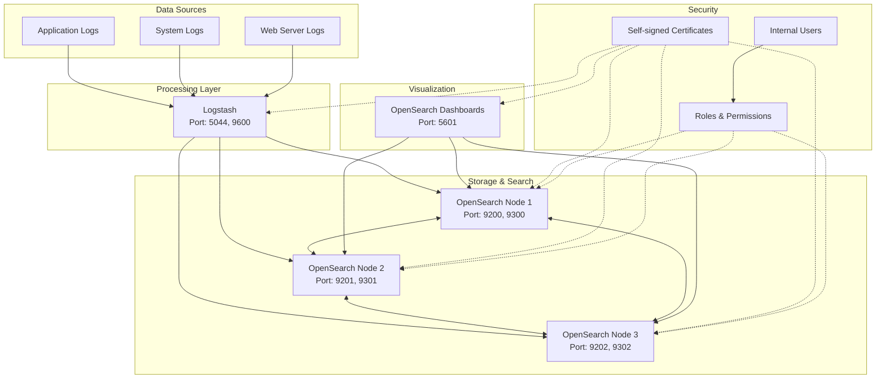

# Hướng dẫn cài đặt OpenSearch Stack trên RHEL

## Mô hình kiến trúc



## Yêu cầu hệ thống

- RHEL 8/9
- Java 11 hoặc Java 17
- RAM: tối thiểu 4GB (khuyến nghị 8GB+)
- Disk: tối thiểu 20GB free space
- User có quyền sudo

## Bước 1: Chuẩn bị môi trường

### 1.1 Cập nhật hệ thống
```bash
sudo dnf update -y
```

### 1.2 Cài đặt Java
```bash
# Cài đặt Java 11
sudo dnf install java-11-openjdk java-11-openjdk-devel -y

# Kiểm tra version
java -version
```

### 1.3 Tạo user và directories
```bash
# Tạo opensearch user
sudo useradd -m -s /bin/bash opensearch

# Tạo directories
sudo mkdir -p /opt/opensearch/{opensearch,logstash,dashboards}
sudo mkdir -p /var/log/opensearch/{opensearch,logstash,dashboards}
sudo mkdir -p /var/lib/opensearch

# Phân quyền
sudo chown -R opensearch:opensearch /opt/opensearch
sudo chown -R opensearch:opensearch /var/log/opensearch
sudo chown -R opensearch:opensearch /var/lib/opensearch
```

### 1.4 Cấu hình system limits
```bash
# Chỉnh sửa limits
sudo tee -a /etc/security/limits.conf << EOF
opensearch soft nofile 65536
opensearch hard nofile 65536
opensearch soft nproc 4096
opensearch hard nproc 4096
opensearch soft memlock unlimited
opensearch hard memlock unlimited
EOF

# Cấu hình sysctl
sudo tee -a /etc/sysctl.conf << EOF
vm.max_map_count=262144
vm.swappiness=1
EOF

sudo sysctl -p
```

## Bước 2: Cài đặt OpenSearch

### 2.1 Download và giải nén
```bash
cd /tmp
wget https://artifacts.opensearch.org/releases/bundle/opensearch/2.11.0/opensearch-2.11.0-linux-x64.tar.gz

# Giải nén vào thư mục đích
sudo tar -xzf opensearch-2.11.0-linux-x64.tar.gz -C /opt/opensearch/
sudo mv /opt/opensearch/opensearch-2.11.0 /opt/opensearch/opensearch-current
sudo chown -R opensearch:opensearch /opt/opensearch/opensearch-current
```

### 2.2 Tạo certificate tự ký
```bash
# Chuyển sang user opensearch
sudo su - opensearch

cd /opt/opensearch/opensearch-current

# Tạo CA certificate
./plugins/opensearch-security/tools/install_demo_configuration.sh -y

# Hoặc tạo custom certificates
mkdir -p config/certificates
cd config/certificates

# Tạo CA key và certificate
openssl genrsa -out ca-key.pem 2048
openssl req -new -x509 -sha256 -key ca-key.pem -out ca.pem -days 3650 \
  -subj "/C=VN/ST=HN/L=Hanoi/O=MyOrg/OU=IT/CN=opensearch-ca"

# Tạo node certificate
openssl genrsa -out node-key.pem 2048
openssl req -new -key node-key.pem -out node.csr \
  -subj "/C=VN/ST=HN/L=Hanoi/O=MyOrg/OU=IT/CN=opensearch-node1"

# Ký certificate
openssl x509 -req -in node.csr -CA ca.pem -CAkey ca-key.pem -CAcreateserial \
  -out node.pem -days 3650 -sha256

# Tạo admin certificate
openssl genrsa -out admin-key.pem 2048
openssl req -new -key admin-key.pem -out admin.csr \
  -subj "/C=VN/ST=HN/L=Hanoi/O=MyOrg/OU=IT/CN=opensearch-admin"

openssl x509 -req -in admin.csr -CA ca.pem -CAkey ca-key.pem -CAcreateserial \
  -out admin.pem -days 3650 -sha256

cd ../..
```

### 2.3 Cấu hình OpenSearch
```bash
# Backup cấu hình gốc
cp config/opensearch.yml config/opensearch.yml.backup

# Tạo cấu hình mới
cat > config/opensearch.yml << 'EOF'
cluster.name: opensearch-cluster
node.name: opensearch-node1
path.data: /var/lib/opensearch
path.logs: /var/log/opensearch/opensearch
network.host: 0.0.0.0
http.port: 9200
transport.port: 9300
discovery.type: single-node

# Security settings
plugins.security.ssl.transport.pemcert_filepath: certificates/node.pem
plugins.security.ssl.transport.pemkey_filepath: certificates/node-key.pem
plugins.security.ssl.transport.pemtrustedcas_filepath: certificates/ca.pem
plugins.security.ssl.http.enabled: true
plugins.security.ssl.http.pemcert_filepath: certificates/node.pem
plugins.security.ssl.http.pemkey_filepath: certificates/node-key.pem
plugins.security.ssl.http.pemtrustedcas_filepath: certificates/ca.pem
plugins.security.authcz.admin_dn:
  - "CN=opensearch-admin,OU=IT,O=MyOrg,L=Hanoi,ST=HN,C=VN"
plugins.security.nodes_dn:
  - "CN=opensearch-node1,OU=IT,O=MyOrg,L=Hanoi,ST=HN,C=VN"
plugins.security.allow_default_init_securityindex: true
EOF
```

### 2.4 Tạo systemd service
```bash
# Thoát user opensearch
exit

# Tạo service file
sudo tee /etc/systemd/system/opensearch.service << 'EOF'
[Unit]
Description=OpenSearch
Documentation=https://opensearch.org/
Wants=network-online.target
After=network-online.target

[Service]
Type=notify
RuntimeDirectory=opensearch
PrivateTmp=true
Environment=OPENSEARCH_HOME=/opt/opensearch/opensearch-current
Environment=OPENSEARCH_PATH_CONF=/opt/opensearch/opensearch-current/config
Environment=JAVA_HOME=/usr/lib/jvm/java-11-openjdk
WorkingDirectory=/opt/opensearch/opensearch-current
User=opensearch
Group=opensearch
ExecStart=/opt/opensearch/opensearch-current/bin/opensearch
StandardOutput=journal
StandardError=inherit
SyslogIdentifier=opensearch
LimitNOFILE=65536
LimitNPROC=4096
LimitAS=infinity
LimitFSIZE=infinity
TimeoutStopSec=0
KillSignal=SIGTERM
KillMode=process
SendSIGKILL=no
SuccessExitStatus=143

[Install]
WantedBy=multi-user.target
EOF

# Reload systemd và start service
sudo systemctl daemon-reload
sudo systemctl enable opensearch
sudo systemctl start opensearch
```

## Bước 3: Cài đặt OpenSearch Dashboards

### 3.1 Download và giải nén
```bash
cd /tmp
wget https://artifacts.opensearch.org/releases/bundle/opensearch-dashboards/2.11.0/opensearch-dashboards-2.11.0-linux-x64.tar.gz

sudo tar -xzf opensearch-dashboards-2.11.0-linux-x64.tar.gz -C /opt/opensearch/
sudo mv /opt/opensearch/opensearch-dashboards-2.11.0 /opt/opensearch/dashboards-current
sudo chown -R opensearch:opensearch /opt/opensearch/dashboards-current
```

### 3.2 Cấu hình Dashboards
```bash
sudo su - opensearch
cd /opt/opensearch/dashboards-current

# Backup cấu hình gốc
cp config/opensearch_dashboards.yml config/opensearch_dashboards.yml.backup

# Tạo cấu hình mới
cat > config/opensearch_dashboards.yml << 'EOF'
server.port: 5601
server.host: "0.0.0.0"
server.name: "opensearch-dashboards"
opensearch.hosts: ["https://localhost:9200"]
opensearch.ssl.verificationMode: none
opensearch.username: admin
opensearch.password: admin
opensearch.requestHeadersAllowlist: ["securitytenant","Authorization"]
opensearch_security.multitenancy.enabled: true
opensearch_security.multitenancy.tenants.preferred: ["Private", "Global"]
opensearch_security.readonly_mode.roles: ["kibana_read_only"]
server.ssl.enabled: true
server.ssl.certificate: /opt/opensearch/opensearch-current/config/certificates/node.pem
server.ssl.key: /opt/opensearch/opensearch-current/config/certificates/node-key.pem
opensearch_security.cookie.secure: true
EOF

exit
```

### 3.3 Tạo systemd service cho Dashboards
```bash
sudo tee /etc/systemd/system/opensearch-dashboards.service << 'EOF'
[Unit]
Description=OpenSearch Dashboards
Documentation=https://opensearch.org/
Wants=network-online.target
After=network-online.target opensearch.service

[Service]
Type=simple
Environment=NODE_ENV=production
WorkingDirectory=/opt/opensearch/dashboards-current
User=opensearch
Group=opensearch
ExecStart=/opt/opensearch/dashboards-current/bin/opensearch-dashboards
StandardOutput=journal
StandardError=inherit
SyslogIdentifier=opensearch-dashboards
LimitNOFILE=65536
TimeoutStopSec=0
KillSignal=SIGTERM
KillMode=process
SendSIGKILL=no

[Install]
WantedBy=multi-user.target
EOF

sudo systemctl daemon-reload
sudo systemctl enable opensearch-dashboards
sudo systemctl start opensearch-dashboards
```

## Bước 4: Cài đặt Logstash

### 4.1 Download và giải nén
```bash
cd /tmp
wget https://artifacts.elastic.co/downloads/logstash/logstash-8.11.0-linux-x86_64.tar.gz

sudo tar -xzf logstash-8.11.0-linux-x86_64.tar.gz -C /opt/opensearch/
sudo mv /opt/opensearch/logstash-8.11.0 /opt/opensearch/logstash-current
sudo chown -R opensearch:opensearch /opt/opensearch/logstash-current
```

### 4.2 Cấu hình Logstash
```bash
sudo su - opensearch
cd /opt/opensearch/logstash-current

# Tạo pipeline configuration
mkdir -p config/pipeline
cat > config/pipeline/logstash.conf << 'EOF'
input {
  beats {
    port => 5044
  }
  
  syslog {
    port => 5140
  }
  
  http {
    port => 8080
  }
}

filter {
  if [type] == "syslog" {
    grok {
      match => { "message" => "%{SYSLOGTIMESTAMP:timestamp} %{GREEDYDATA:message}" }
    }
    
    date {
      match => [ "timestamp", "MMM  d HH:mm:ss", "MMM dd HH:mm:ss" ]
    }
  }
  
  # Add hostname
  mutate {
    add_field => { "hostname" => "%{[agent][hostname]}" }
  }
}

output {
  opensearch {
    hosts => ["https://localhost:9200"]
    index => "logstash-%{+YYYY.MM.dd}"
    user => "admin"
    password => "admin"
    ssl => true
    ssl_certificate_verification => false
    template_name => "logstash"
    template_pattern => "logstash-*"
    template_overwrite => true
  }
  
  stdout {
    codec => rubydebug
  }
}
EOF

# Cấu hình chính
cat > config/logstash.yml << 'EOF'
node.name: logstash-node1
path.data: /var/lib/opensearch
path.logs: /var/log/opensearch/logstash
path.settings: /opt/opensearch/logstash-current/config
pipeline.workers: 4
pipeline.batch.size: 125
pipeline.batch.delay: 50
queue.type: memory
config.reload.automatic: true
config.reload.interval: 3s
http.host: "0.0.0.0"
http.port: 9600
log.level: info
EOF

# Cấu hình pipelines
cat > config/pipelines.yml << 'EOF'
- pipeline.id: main
  path.config: "/opt/opensearch/logstash-current/config/pipeline/logstash.conf"
EOF

exit
```

### 4.3 Tạo systemd service cho Logstash
```bash
sudo tee /etc/systemd/system/logstash.service << 'EOF'
[Unit]
Description=Logstash
Documentation=https://www.elastic.co
Wants=network-online.target
After=network-online.target

[Service]
Type=simple
Environment=JAVA_HOME=/usr/lib/jvm/java-11-openjdk
Environment=LS_SETTINGS_DIR=/opt/opensearch/logstash-current/config
WorkingDirectory=/opt/opensearch/logstash-current
User=opensearch
Group=opensearch
ExecStart=/opt/opensearch/logstash-current/bin/logstash
StandardOutput=journal
StandardError=inherit
SyslogIdentifier=logstash
LimitNOFILE=65536
LimitNPROC=8192
TimeoutStopSec=0
KillSignal=SIGTERM
KillMode=process
SendSIGKILL=no

[Install]
WantedBy=multi-user.target
EOF

sudo systemctl daemon-reload
sudo systemctl enable logstash
sudo systemctl start logstash
```

## Bước 5: Cấu hình Firewall

```bash
# Mở các port cần thiết
sudo firewall-cmd --permanent --add-port=9200/tcp  # OpenSearch HTTP
sudo firewall-cmd --permanent --add-port=9300/tcp  # OpenSearch Transport
sudo firewall-cmd --permanent --add-port=5601/tcp  # Dashboards
sudo firewall-cmd --permanent --add-port=5044/tcp  # Logstash Beats
sudo firewall-cmd --permanent --add-port=9600/tcp  # Logstash API
sudo firewall-cmd --permanent --add-port=8080/tcp  # Logstash HTTP
sudo firewall-cmd --reload
```

## Bước 6: Kiểm tra và xác thực

### 6.1 Kiểm tra services
```bash
sudo systemctl status opensearch
sudo systemctl status opensearch-dashboards
sudo systemctl status logstash
```

### 6.2 Test connectivity
```bash
# Test OpenSearch
curl -k -u admin:admin https://localhost:9200

# Test Dashboards (mở browser)
https://your-server-ip:5601

# Test Logstash
curl http://localhost:9600/_node/stats
```

### 6.3 Gửi test log
```bash
# Gửi test message qua HTTP
curl -H "Content-Type: application/json" -XPOST 'http://localhost:8080' -d '
{
  "@timestamp": "'$(date -u +%Y-%m-%dT%H:%M:%S.%3NZ)'",
  "message": "Test log message",
  "level": "INFO",
  "service": "test-app"
}'
```

## Bước 7: Tạo Index Template và Policy

### 7.1 Tạo index template
```bash
curl -k -u admin:admin -X PUT "https://localhost:9200/_index_template/logstash-template" \
-H "Content-Type: application/json" -d'
{
  "index_patterns": ["logstash-*"],
  "template": {
    "settings": {
      "number_of_shards": 1,
      "number_of_replicas": 1,
      "index.lifecycle.name": "logstash-policy"
    },
    "mappings": {
      "properties": {
        "@timestamp": {
          "type": "date"
        },
        "message": {
          "type": "text",
          "analyzer": "standard"
        },
        "level": {
          "type": "keyword"
        }
      }
    }
  }
}
'
```

## Troubleshooting

### Lỗi thường gặp:
1. **Memory errors**: Tăng heap size trong `jvm.options`
2. **Permission denied**: Kiểm tra ownership của directories
3. **SSL errors**: Verify certificate paths và permissions
4. **Port conflicts**: Check các service khác đang sử dụng ports

### Logs để debug:
```bash
# OpenSearch logs
tail -f /var/log/opensearch/opensearch/opensearch.log

# Dashboards logs
sudo journalctl -u opensearch-dashboards -f

# Logstash logs
tail -f /var/log/opensearch/logstash/logstash-plain.log
```

## Kết luận

Sau khi hoàn thành các bước trên, bạn sẽ có một OpenSearch stack hoàn chỉnh với:
- OpenSearch cluster chạy trên port 9200 (HTTPS)
- OpenSearch Dashboards trên port 5601 (HTTPS)
- Logstash nhận data từ nhiều sources

Truy cập Dashboards tại: `https://your-server-ip:5601` với user/password: `admin/admin`